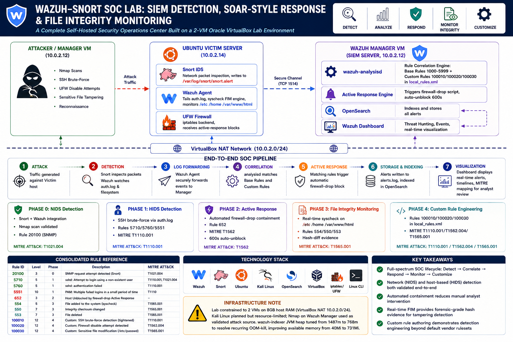

<div align="center">

# 🛡️ Wazuh–Snort SOC Lab: SIEM Detection, SOAR-Style Response, Custom Rule Engineering and False Positive Reduction

*A six-phase, hands-on SOC engineering project — from raw network intrusion detection to custom-authored SIEM correlation rules, formal alert tuning, and a self-hosted SOAR orchestration layer — built entirely in a self-hosted virtual lab.*

---


</div>

---

> ### ⚠️ A note on "SOAR"
> This project is **not** a full SOAR platform. Phases 0–5 demonstrate the fundamental SOAR concept — **automated, detection-triggered response** — implemented using Wazuh's native Active Response module. Phase 6 extends this with a genuine cross-tool orchestration layer (n8n), consuming Wazuh alerts via webhook, enriching them, and notifying analysts in real time — moving this project further toward a real SOAR pattern while still being honest that a production SOAR would add ticketing integration, analyst approval workflows, and multi-tool case management on top of what's built here. This project is scoped and honest about that boundary — and that's deliberate.

---

## 🗺️ Overall Architecture

<p align="center">
  
</p>

<div align="center">

```
Attack / Log Event → Detection (Snort + Wazuh Rules) → Correlation (Wazuh Manager)
      → Response (Active Response) → Visualization (Wazuh Dashboard) → Tuning & Validation
      → Orchestration (n8n Webhook → Enrichment → Notification)
```

</div>

---

## 📚 Project Phases

Each phase builds directly on the last — same lab, same agent, same Manager — progressively layering detection, response, integrity monitoring, custom engineering, formal tuning, and now automated orchestration on top of one shared SOC pipeline.

<table>
<tr>
<td width="8%" align="center"><b>0</b></td>
<td width="42%">🌐 <b>Phase 0 - Snort IDS Integration</b><br><sub>Snort IDS + Wazuh SIEM Integration</sub></td>
<td width="30%">Network IDS-to-SIEM pipeline</td>
<td width="20%" align="center"><a href="docs/Phase0_Snort_IDS_Integration.md"><b>View →</b></a></td>
</tr>
<tr>
<td align="center"><b>1</b></td>
<td>🔐 <b>Phase 1 - SSH Brute Force Detection</b><br><sub>SSH Brute-Force Log Analysis</sub></td>
<td>Log-based correlation rules</td>
<td align="center"><a href="docs/Phase1_SSH_BruteForce_Detection.md"><b>View →</b></a></td>
</tr>
<tr>
<td align="center"><b>2</b></td>
<td>⚡ <b>Phase 2 - Active Response (Automated IP Blocking)</b><br><sub>Wazuh Active Response</sub></td>
<td>SOAR-style auto-remediation</td>
<td align="center"><a href="docs/Phase2_Active_Response.md"><b>View →</b></a></td>
</tr>
<tr>
<td align="center"><b>3</b></td>
<td>🗂️ <b>Phase 3 - File Integrity Monitoring (FIM)</b><br><sub>Real-Time File Integrity Monitoring</sub></td>
<td>FIM, hash-diff verification</td>
<td align="center"><a href="docs/Phase3_File_Integrity_Monitoring.md"><b>View →</b></a></td>
</tr>
<tr>
<td align="center"><b>4</b></td>
<td>🧬 <b>Phase 4 - Custom Wazuh Rules</b><br><sub>Wazuh Rule Authoring</sub></td>
<td>Writing & debugging SIEM correlation rules</td>
<td align="center"><a href="docs/Phase4_Custom_Rule_Authoring.md"><b>View →</b></a></td>
</tr>
<tr>
<td align="center"><b>5</b></td>
<td>🎯 <b>Phase 5 - Alert Tuning & False Positive Reduction</b><br><sub>Detection Engineering — Reducing Alert Fatigue</sub></td>
<td>Baselining, classification, rule-level tuning, regression testing</td>
<td align="center"><a href="docs/Phase5_Alert_Tuning_False_Positive_Reduction.md"><b>View →</b></a></td>
</tr>
<tr>
<td align="center"><b>6</b></td>
<td>🔗 <b>Phase 6 - n8n SOAR Orchestration</b> <sub>(In Progress)</sub><br><sub>Webhook-Driven Alert Enrichment & Notification</sub></td>
<td>Self-hosted workflow automation, IP enrichment, Discord alerting</td>
<td align="center"><a href="docs/Phase6_n8n_SOAR_Orchestration.md"><b>View →</b></a></td>
</tr>
</table>

> 🔄 **Phase 6 (in progress):** [n8n](https://n8n.io) self-hosted on the existing Ubuntu-Victim VM, exposed to the internet via **Cloudflare Tunnel** (fully outbound-initiated — no inbound ports opened, no VPS, no credit card required). A working webhook → IP enrichment (ip-api.com) → message formatting → Discord notification pipeline is built and verified end-to-end with simulated alert data. Remaining: wiring Wazuh's Active Response module to trigger this webhook automatically on real rule `5710`/`100010` detections, and validating enrichment against a real public attacker IP. Full build log, architecture rationale, and troubleshooting narrative in the [Phase 6 doc](docs/Phase6_n8n_SOAR_Orchestration.md).

---

## 🖥️ Lab Architecture

<div align="center">

| Machine | Role | IP Address | Key Software |
|:---:|:---|:---:|:---|
| 🔵 **Wazuh-Manager** | SIEM Server | `10.0.2.12` | Wazuh Manager, Dashboard, OpenSearch |
| 🟠 **Ubuntu-Victim** | Monitored Endpoint + SOAR Node | `10.0.2.14` | Snort IDS, Wazuh Agent, n8n, cloudflared |
| 🟢 **Kali Linux** | Attacker Host | `variable` | Nmap, SSH brute-force tooling |

</div>

All VMs run in Oracle VirtualBox on a shared NAT Network (`10.0.2.0/24`). Where host resource constraints limited concurrent VM uptime, attack traffic was generated from an alternate cross-host source — documented transparently per phase rather than silently substituted. Phase 6 deliberately avoids adding a fourth VM or cloud VPS, instead co-locating n8n on the existing Ubuntu-Victim VM to respect the lab's 8GB RAM ceiling — memory impact was empirically measured and documented rather than assumed safe.

---

## 🔧 Notable Troubleshooting

Real SOC engineering rarely works on the first attempt. These are the debugging stories that best demonstrate hands-on problem-solving across all phases — full detail lives in each phase's doc.

<details>
<summary><b>🔑 GPG keyring import failure — single-character typo</b></summary>
<br>

> A typo (`gunpg-ring` vs `gnupg-ring`) caused opaque, unhelpful APT signature errors during Wazuh Agent installation. Resolved by separating key download from import and testing each step independently.

</details>

<details>
<summary><b>🌐 VirtualBox NAT isolation blocking Dashboard access</b></summary>
<br>

> The host browser couldn't reach the Manager's internal VM IP directly. Resolved via VirtualBox port forwarding, mapping `127.0.0.1:8443` on the host to `10.0.2.12:443` on the guest.

</details>

<details>
<summary><b>👁️ Self-scan traffic invisible to Snort</b></summary>
<br>

> A host scanning its own IP routes traffic through the loopback interface (`lo`), never touching the physical adapter Snort monitors. Confirmed via `ip route get`, resolved by generating attack traffic from a genuinely separate host.

</details>

<details>
<summary><b>💥 OpenSearch (Wazuh Indexer) OOM-kill under memory pressure</b></summary>
<br>

> The indexer was silently killed by the kernel, breaking Dashboard login with no obvious error at first glance. Root-caused via `systemctl status wazuh-indexer` showing `Result: oom-kill`.

</details>

<details>
<summary><b>🧩 XML parser reporting a misleading error line</b></summary>
<br>

> A custom rule's config failed to load with `XMLERR: Attribute '&lt;if_sid' has no value`, pointing at a line that looked syntactically fine. Root cause: an unclosed `&lt;rule&gt;` tag one line above — the parser was still "inside" the open tag when it read the next line. A reminder that reported line numbers in multi-tag XML files can be one or two lines off from the real defect.

</details>

<details>
<summary><b>🎯 Custom rule silently pre-empted by a more specific sibling rule</b></summary>
<br>

> A custom detection rule failed to fire even though its target log line was confirmed present in the alert stream. Root cause: the rule was parented to an overly generic base rule (`if_sid 1002`), while the event was already being classified — and correlation halted — under a more specific sibling rule (`5402`). Fixed by reparenting to the correct, more specific base rule. This reflects a core lesson in Wazuh rule design: correlation is a tree, not a flat list, and the wrong parent silently starves a custom rule of the events it's meant to catch.

</details>

<details>
<summary><b>🚫 Active Response self-lockout during Phase 5 troubleshooting</b></summary>
<br>

> While diagnosing an unrelated SSH configuration issue, repeated invalid-username login attempts from the Wazuh Manager's own IP triggered rule `5710`, and Phase 2's `firewall-drop` Active Response auto-blocked the Manager itself. Resolved by manually clearing the `iptables` rule on the Victim. A genuine SOC finding: aggressive automated response can create administrative friction against trusted infrastructure — full writeup in the Phase 5 doc.

</details>

<details>
<summary><b>📉 Tuned rule matched but never appeared in the Dashboard (Phase 5)</b></summary>
<br>

> A new tuning rule set to `level="2"` matched correctly but never showed up in Discover. Root cause: Wazuh's default `<log_alert_level>3</log_alert_level>` silently drops any rule below level 3 from being indexed at all, regardless of whether it matched. Resolved by raising the rule to `level="3"`.

</details>

<details>
<summary><b>🌐 Cloudflare Tunnel hanging indefinitely — root cause was broken DHCP-assigned DNS, not carrier blocking (Phase 6)</b></summary>
<br>

> `cloudflared tunnel` passed all environment preflight checks but hung indefinitely at tunnel registration. Initially suspected mobile-carrier deep packet inspection after switching hotspots produced a more specific `dial tcp: lookup ... i/o timeout` error. Root-caused to the VM's DHCP-assigned DNS server being unreachable through VirtualBox's NAT layer — runtime `resolvectl` fixes were silently overridden by DHCP re-injection until permanently resolved via a dedicated netplan override file with `dhcp4-overrides: use-dns: false`. A lesson in peeling back layers: application symptom → protocol test → raw connectivity → DNS-specific test → persistent-vs-runtime config, rather than accepting the first plausible explanation. Full writeup in the Phase 6 doc.

</details>

<details>
<summary><b>📋 Multi-line curl commands corrupted by VM console paste handling (Phase 6)</b></summary>
<br>

> Pasting multi-line `curl` commands directly into the VirtualBox console terminal repeatedly corrupted the input (dropped port numbers, missing slashes), producing misleading parser errors. Resolved by writing commands into a file via `nano` and executing as a script instead of pasting directly at the shell prompt — a reminder to verify actual received input before assuming a logic error when a correct-looking command throws a strange error.

</details>

---

## 🚨 SOC-Style Alert Reference (sample)

<div align="center">

| 🔍 Field | 📄 Detail |
|:---|:---|
| **Alert Name** | SNMP AgentX/tcp request — Attempted Information Leak |
| **Severity** | 🟡 Medium — Wazuh Level **8** · Snort Priority **2** |
| **Source → Destination** | `10.0.2.12` → `10.0.2.14` |
| **MITRE ATT&CK** | `T1046` Network Service Discovery · `T1040` Network Sniffing |
| **Impact** | Reconnaissance probing for an exposed SNMP service |
| **Recommended Action** | Disable SNMP if unused · Restrict via firewall · Enforce SNMPv3 |

</div>

> Full SOC analysis tables (Alert Name, Severity, Source/Destination, MITRE ATT&CK, Impact, Recommended Action) for every detection across all phases are documented in each phase's `docs/` file.

---

## 📁 Repository Structure

```
wazuh-snort-soc-lab/
├── 📄 README.md                        ← You are here
│
├── 📂 docs/
│   ├── Phase0_Snort_IDS_Integration.md
│   ├── Phase1_SSH_BruteForce_Detection.md
│   ├── Phase2_Active_Response.md
│   ├── Phase3_File_Integrity_Monitoring.md
│   ├── Phase4_Custom_Rule_Authoring.md
│   ├── Phase5_Alert_Tuning_False_Positive_Reduction.md
│   ├── Phase6_n8n_SOAR_Orchestration.md   ← In progress
│   └── Final_Report.pdf                ← Consolidated writeup
│
├── 📂 diagrams/
│   ├── overall_system_architecture.png
│   ├── phase0_architecture.png
│   ├── phase1_architecture.png
│   ├── phase2_architecture.png
│   ├── phase3_architecture.png
│   ├── phase4_architecture.png
│   └── phase5_architecture.png
│
├── 📂 screenshots/
│   ├── phase0/
│   ├── phase1/
│   ├── phase2/
│   ├── phase3/
│   ├── phase4/
│   ├── phase5/
│   └── phase6/
│
├── 📂 config/
│   ├── local_rules.xml                 # Redacted — no secrets
│   ├── ossec.conf.snippet
│   └── snort.conf.snippet
│
└── 📄 LICENSE
```

> ⚠️ Files in `config/` are **redacted snippets** for demonstration only. Files containing authentication secrets (`client.keys`, full `ossec.conf`, n8n credentials, webhook secrets) are intentionally excluded — see `.gitignore`.

---

## 🛠️ Tools & Technologies

<div align="center">


</div>

---

## 📜 License

> This project is for educational purposes as part of independent SOC / cybersecurity coursework.

---

<div align="center">

*Built with 🔐 for learning — six phases, one SOC pipeline, zero shortcuts.*

</div>
