

# Phase 1 - SSH Brute Force Detection
### Host-Based Intrusion Detection via Authentication Log Correlation

*A step-by-step record of implementing host-based SSH brute-force detection, building on the existing Snort NIDS integration (Phase 0).*

---

---

## 🗺️ Architecture Diagram

  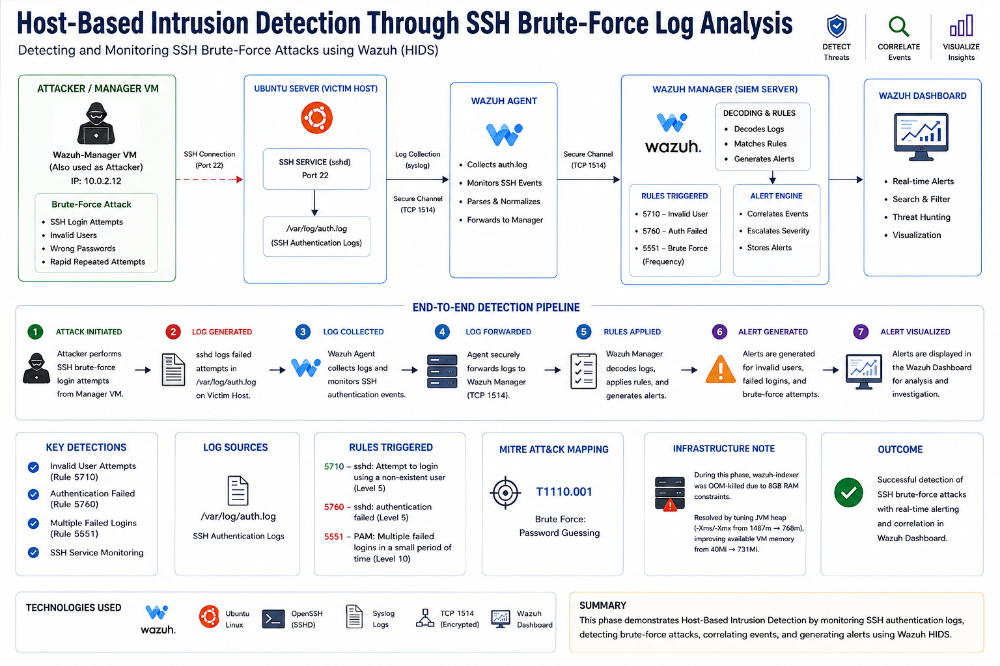

---

### 🔷 PHASE 1 — SSH Brute Force Detection

| Step | Command(s) Used | Screenshot | Description |
|---|---|---|---|
| **1. Confirm SSH Service on Victim** | `sudo systemctl status ssh` | — | Verified `sshd` was installed and actively listening on port 22 on the Ubuntu-Victim host — the log source this phase depends on. |
| **2. Confirm auth.log Is Active** | `sudo tail -n 20 /var/log/auth.log` | [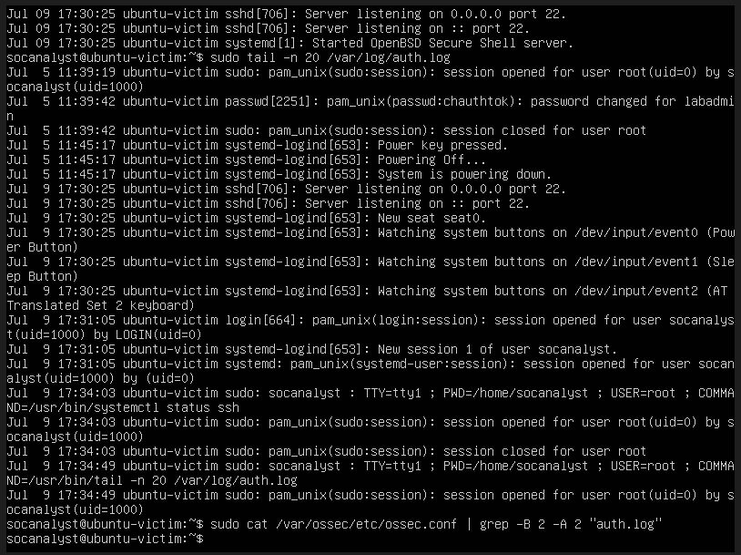](../screenshots/phase1/Fig2.png) | Confirmed `/var/log/auth.log` was actively recording session and login activity, establishing it as a valid Wazuh monitoring target. |
| **3. Add `<localfile>` for auth.log** | `sudo nano /var/ossec/etc/ossec.conf` *(added `<localfile>` block, `log_format syslog`, location `/var/log/auth.log`)* | [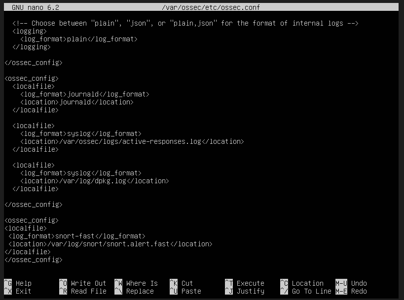](../screenshots/phase1/Fig3.png) | Configured the Wazuh Agent to monitor SSH authentication logs, placed correctly within an existing `<ossec_config>` block alongside other syslog-format entries. |
| **4. Restart Agent & Verify Monitoring** | `sudo systemctl restart wazuh-agent` `sudo grep "auth.log" /var/ossec/logs/ossec.log` | [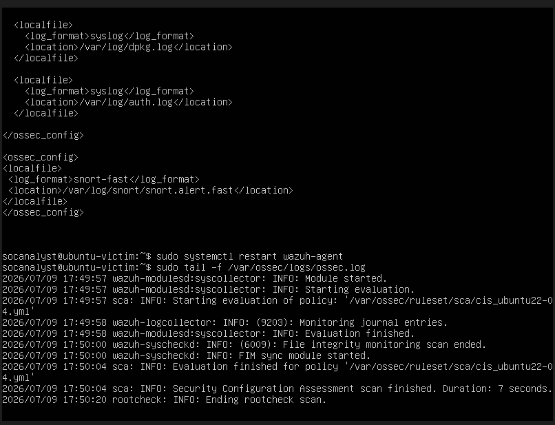](../screenshots/phase1/Fig4.png) | Confirmed via agent log: `wazuh-logcollector` actively analyzing `/var/log/auth.log` — the core log-ingestion point for this phase. |
| **5. Confirm Password Authentication Enabled** | `sudo grep -i "PasswordAuthentication" /etc/ssh/sshd_config` | [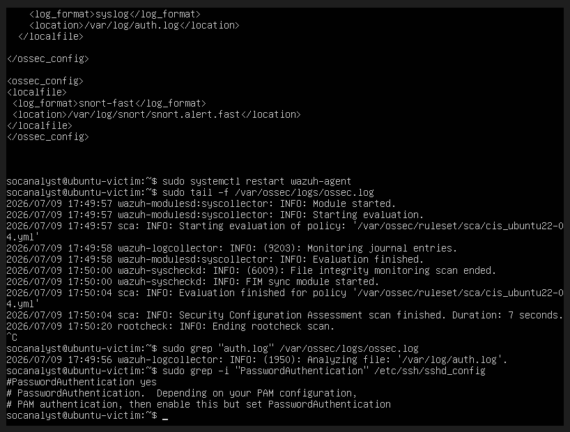](../screenshots/phase1/Fig5.png) | Verified `PasswordAuthentication` was not explicitly disabled (commented default = yes), ensuring simulated failed logins would reach `sshd`'s authentication logic. |
| **6. Install sshpass on Manager** | `sudo yum install sshpass -y` | — | Installed the non-interactive SSH password automation tool on the Wazuh-Manager VM, which doubled as the attacker host (consistent with the earlier Kali resource-constraint pivot). |
| **7. Resolve SSH Key-Exchange Compatibility** | `ssh -Q kex` `sudo update-crypto-policies --show` | [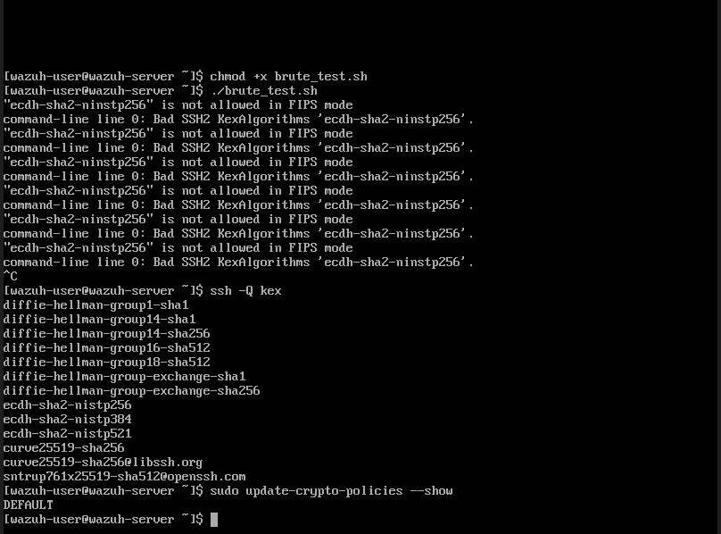](../screenshots/phase1/Fig7.png) | Diagnosed initial connection failures as a `KexAlgorithms` mismatch (not a FIPS restriction as first suspected); confirmed `ecdh-sha2-nistp256` was supported and the crypto policy was `DEFAULT`. |
| **8. Build & Run Brute-Force Script (Invalid User)** | `nano brute_test.sh` `chmod +x brute_test.sh` `./brute_test.sh` | [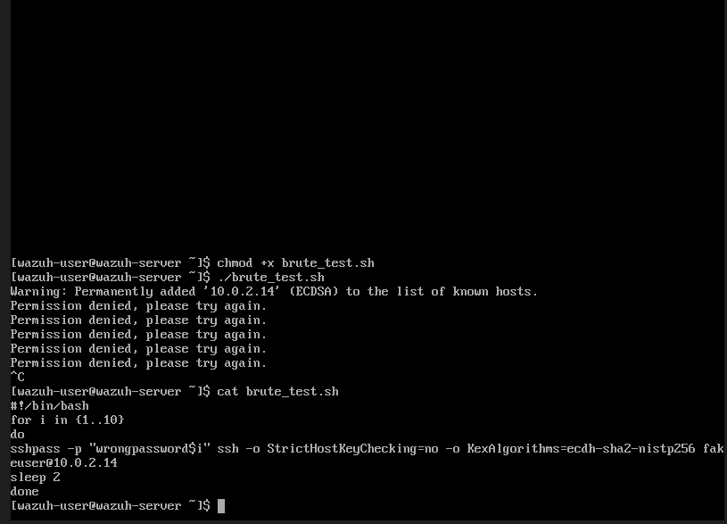](../screenshots/phase1/Fig8.png) | Scripted 10 failed SSH login attempts against a **non-existent** user (`fakeuser`) from Manager (`10.0.2.12`) to Victim (`10.0.2.14`). |
| **9. Verify Failures Logged Locally** | `sudo grep "Failed password" /var/log/auth.log \| tail -10` | [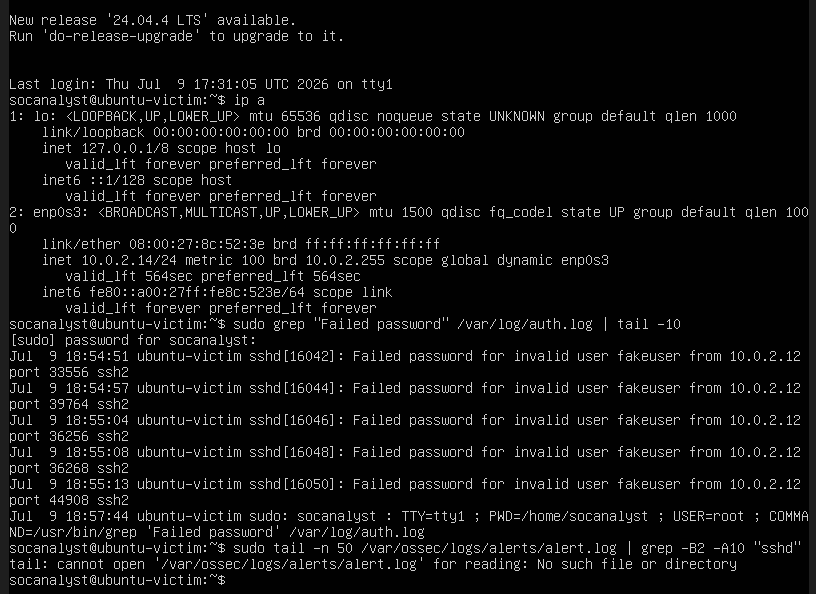](../screenshots/phase1/Fig9.png) | Confirmed 10 fresh `Failed password for invalid user fakeuser` entries on the Victim, proving the attack traffic reached `sshd`. |
| **10. Confirm Rule 5710 Fired** | `sudo grep -i "sshd" /var/ossec/logs/alerts/alerts.log` | [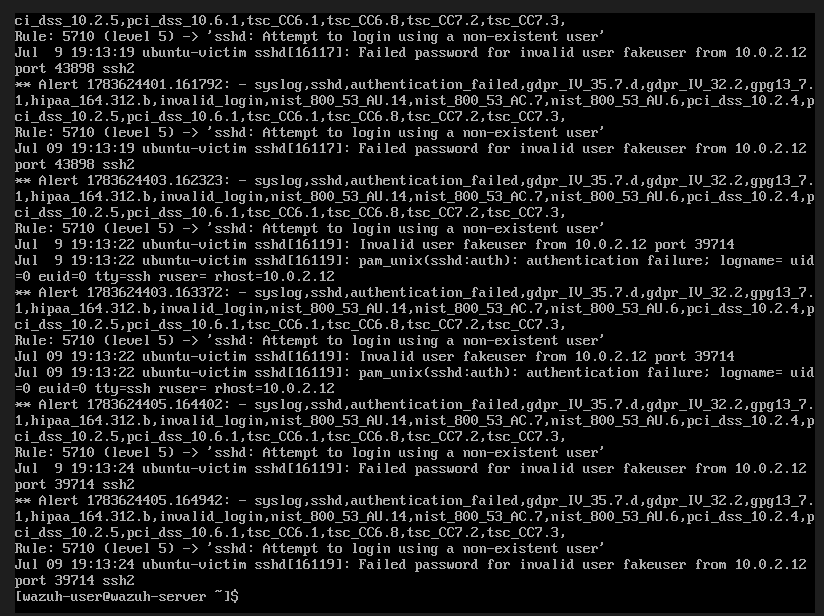](../screenshots/phase1/Fig10.png) | Confirmed **Rule 5710** (Level 5) — *"sshd: Attempt to login using a non-existent user"* — fired for each attempt and mapped to **MITRE ATT&CK T1110.001**. |
| **11. Run Second Test (Valid User)** | `nano brute_test2.sh` *(target changed to real user `socanalyst`)* `./brute_test2.sh` | — | Repeated the attack against a **valid** existing account using incorrect passwords to trigger Wazuh's separate "known user, wrong password" detection path. |
| **12. Confirm Rule 5760 & Escalation to 5551** | `sudo grep -i "sshd" /var/ossec/logs/alerts/alerts.log \| tail -40` | [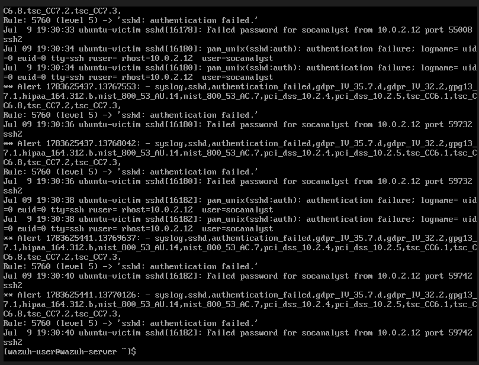](../screenshots/phase1/Fig12.png) | Confirmed **Rule 5760** (Level 5) — *"sshd: authentication failed"* — and **Rule 5551** (Level 10) — *"PAM: Multiple failed logins in a small period of time"* — the frequency-correlated brute-force escalation rule. |
| **13. Verify Full Detection Chain in Dashboard** | *(Dashboard)* **Threat Hunting → Events** → Search: `sshd` | [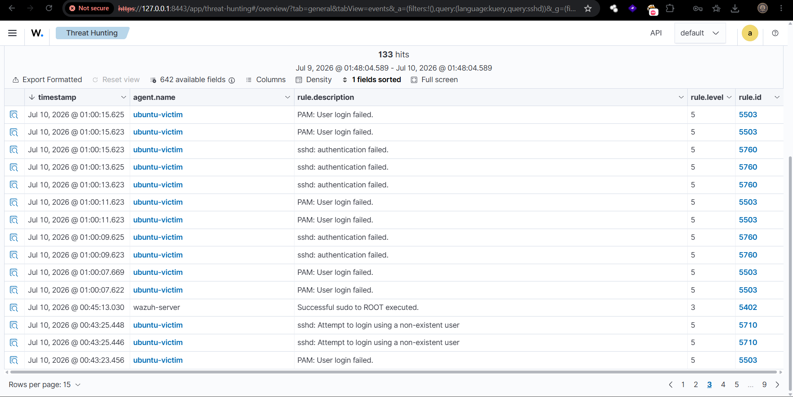](../screenshots/phase1/Fig13.png) | Final verification: **133 hits** across Rules **5710**, **5760**, **5503**, and **5551**, all correctly attributed to `srcip: 10.0.2.12` → `agent.name: ubuntu-victim`. |

**🔧 Infrastructure Note (documented incident):** During this phase, `wazuh-indexer` was OOM-killed due to 8GB host RAM constraints. Diagnosed via `systemctl status wazuh-indexer` (`Result: oom-kill`), resolved by restarting the service and subsequently **tuning the JVM heap** (`-Xms`/`-Xmx` from `1487m` → `768m` in `/etc/wazuh-indexer/jvm.options`), improving available VM memory from **40Mi → 731Mi**.

---

### 📊 Detection Rule Reference Table

| Rule ID | Level | Description | Trigger Condition | MITRE ATT&CK |
|---|---|---|---|---|
| 5710 | 5 | sshd: Attempt to login using a non-existent user | Login attempt, invalid/unknown username | T1110.001, T1021.004 |
| 5760 | 5 | sshd: authentication failed | Login attempt, valid username, wrong password | T1110.001 |
| 5503 | 5 | PAM: User login failed | PAM-layer correlation of above | — |
| **5551** | **10** | **PAM: Multiple failed logins in a small period of time** | **Frequency-correlated brute-force escalation** | T1110 |

---

*Built with 🔐 for learning — by a future SOC analyst.*

