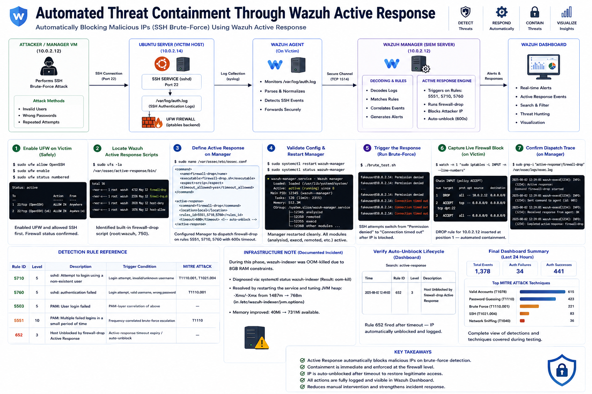
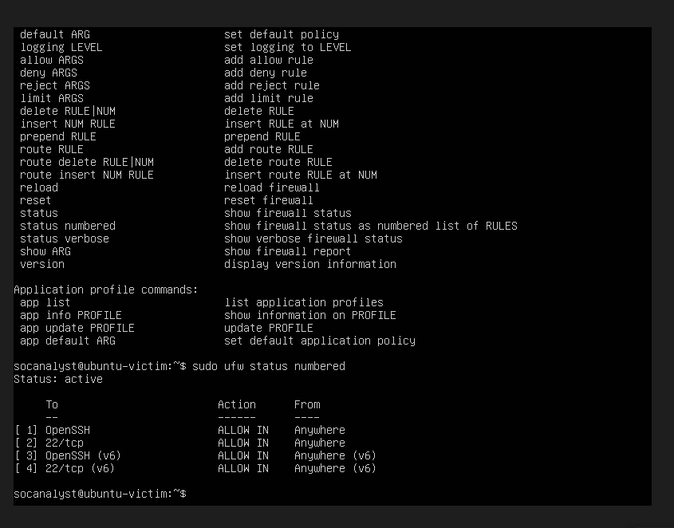
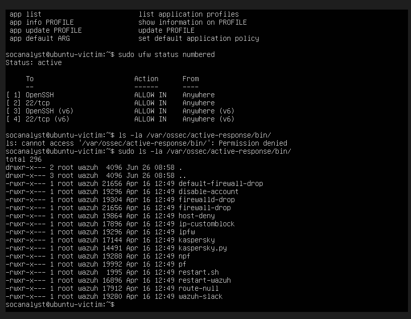
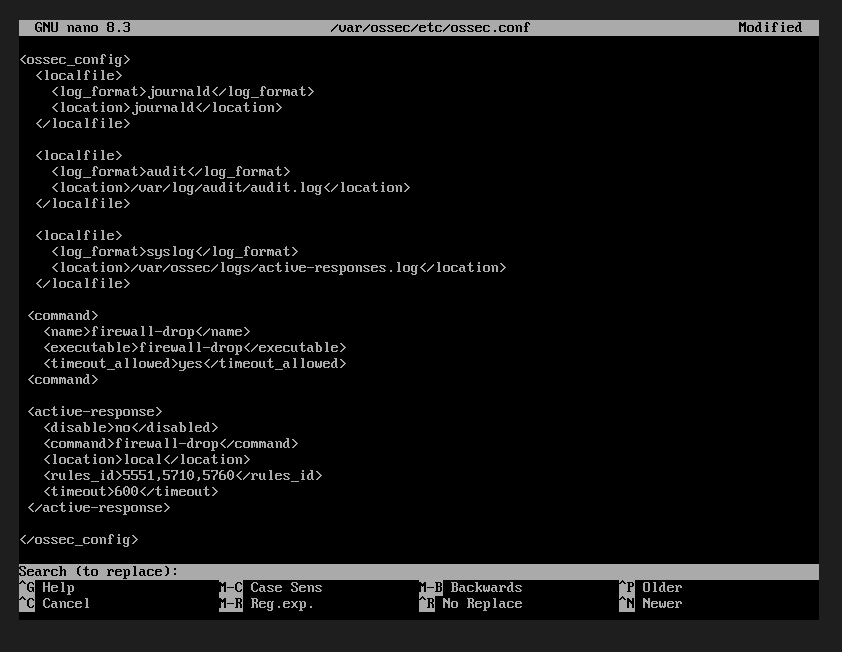
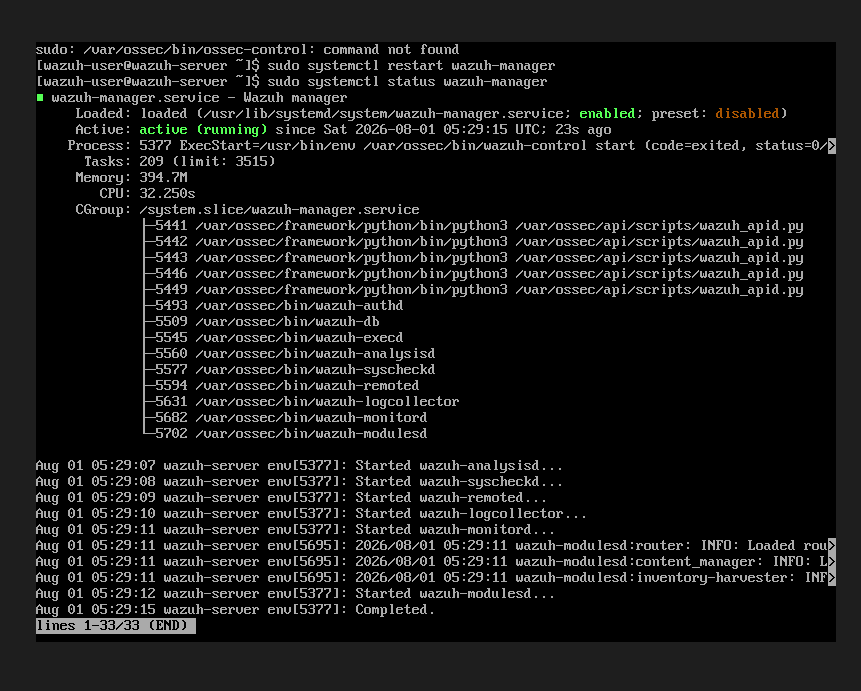
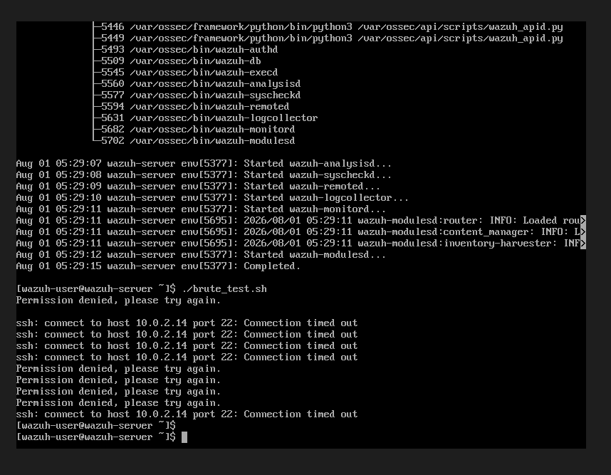
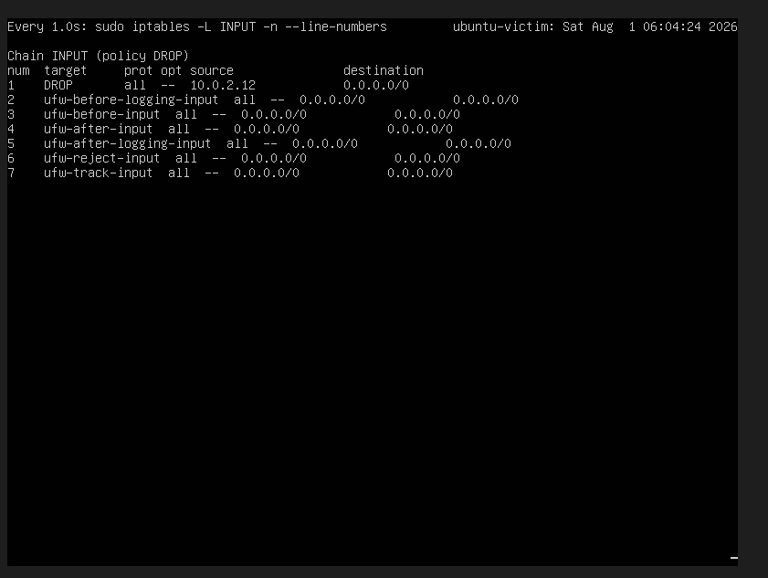
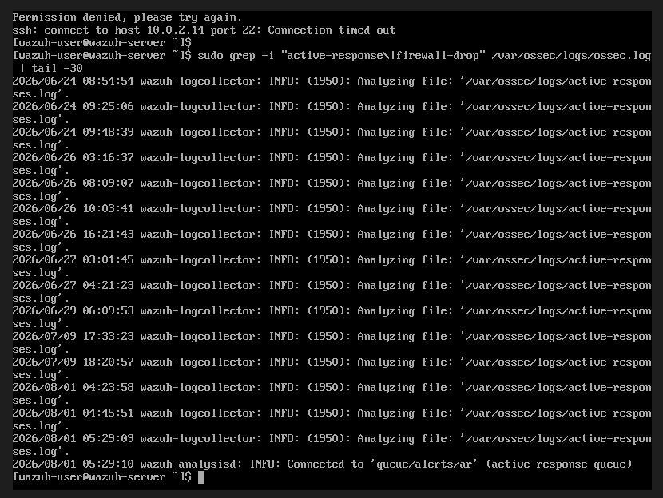
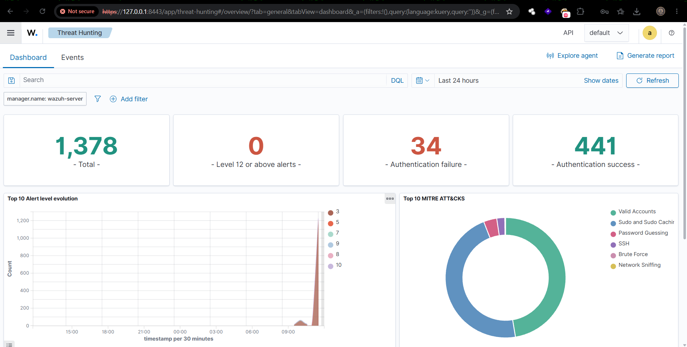

# Phase 2 - Active Response (Automated IP Blocking)
### SOAR-Style Automated Threat Containment

*A step-by-step record of implementing automated threat containment, building on the SSH brute-force detection rules established in Phase 1.*

---

---

## 🗺️ Architecture Diagram

  

---

### 🔷 PHASE 2 — Active Response (Automated IP Blocking)

| Step | Command(s) Used | Screenshot | Description |
|---|---|---|---|
| **1. Enable UFW on Victim (Safely)** | `sudo ufw allow OpenSSH` `sudo ufw enable` `sudo ufw status numbered` |  | Enabled UFW firewall on Ubuntu-Victim, allowing SSH first to avoid remote lockout, confirmed `Status: active` with SSH permitted on IPv4/IPv6. |
| **2. Locate Wazuh's Active Response Scripts** | `sudo ls -la /var/ossec/active-response/bin/` |  | Identified the built-in `firewall-drop` script (root:wazuh, 750 permissions) shipped by default with the Wazuh Agent installation. |
| **3. Define Active Response on Manager** | `sudo nano /var/ossec/etc/ossec.conf` *(added `<command>` and `<active-response>` blocks referencing rules 5551, 5710, 5760)* |  | Configured the Manager to automatically dispatch the `firewall-drop` command to the Agent whenever the SSH brute-force rules from Phase 1 fire, with a 600-second auto-unblock timeout. |
| **4. Validate Config & Restart Manager** | `sudo systemctl restart wazuh-manager` `sudo systemctl status wazuh-manager` |  | Confirmed clean restart with all modules (`analysisd`, `execd`, `remoted`, etc.) active — no XML parsing errors after correcting two tag-mismatch typos in the config. |
| **5. Trigger the Response** | `./brute_test.sh` *(re-run from Manager)* |  | Re-ran the Phase 1 brute-force script; observed a live shift in SSH client behavior from `Permission denied` to `Connection timed out` mid-attack — the signature of an active kernel-level block. |
| **6. Capture Live Firewall Block** | `watch -n 1 'sudo iptables -L INPUT -n --line-numbers'` |  | Live-captured a `DROP` rule for `10.0.2.12` inserted at position 1 of the `INPUT` chain — direct proof of automated containment, independent of UFW's own rule bookkeeping. |
| **7. Confirm Dispatch Trace on Manager** | `sudo grep -i "active-response\|firewall-drop" /var/ossec/logs/ossec.log` |  | Verified the Manager's JSON dispatch trace: alert → `add` command → Agent `firewall-drop` execution → `check_keys` → `continue` → `Ended`. |
| **8. Verify Auto-Unblock Lifecycle** | *(Dashboard)* **Threat Hunting → Events** → Search: `active-response` |  | Confirmed **Rule 652** — *"Host Unblocked by firewall-drop Active Response"* (level 3) — fired after the timeout window, proving the full add-block-unblock lifecycle completed and was independently logged. Inspecting the rule definition also confirmed it maps to real compliance frameworks — **PCI DSS**, **GDPR**, **NIST-800-53**, and **GPG13** — reinforcing this control's audit relevance beyond just the lab. |
| **9. Final Dashboard Summary** | *(Dashboard)* **Threat Hunting → Dashboard** *(no filter, Last 24 hours)* |  | Full-picture view: 1,378 total events, 34 authentication failures, 441 successes, MITRE ATT&CK breakdown showing Valid Accounts, Password Guessing, Brute Force, SSH, and Network Sniffing techniques covered across testing. |

---

### 📊 Detection Rule Reference Table

| Rule ID | Level | Description | Trigger Condition | MITRE ATT&CK |
|---|---|---|---|---|
| 652 | 3 | Host Unblocked by firewall-drop Active Response | Active-response timeout expiry / auto-unblock | — |

---

*Built with 🔐 for learning — by a future SOC analyst.*

