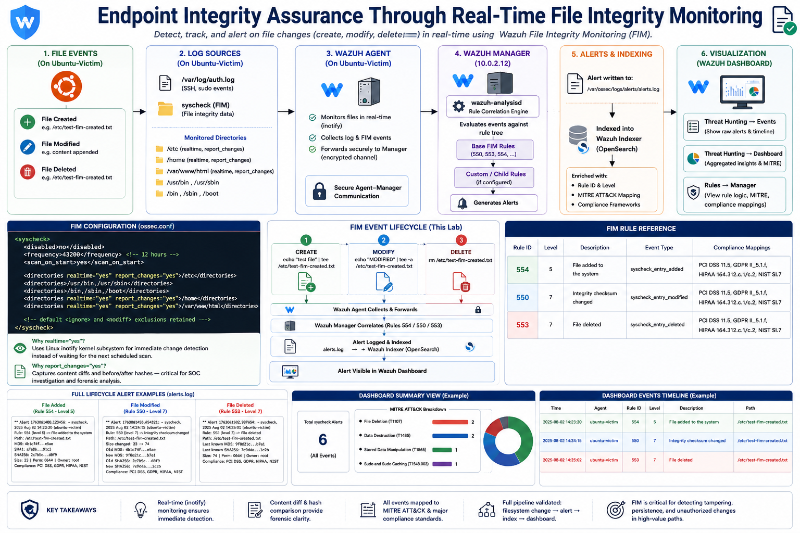
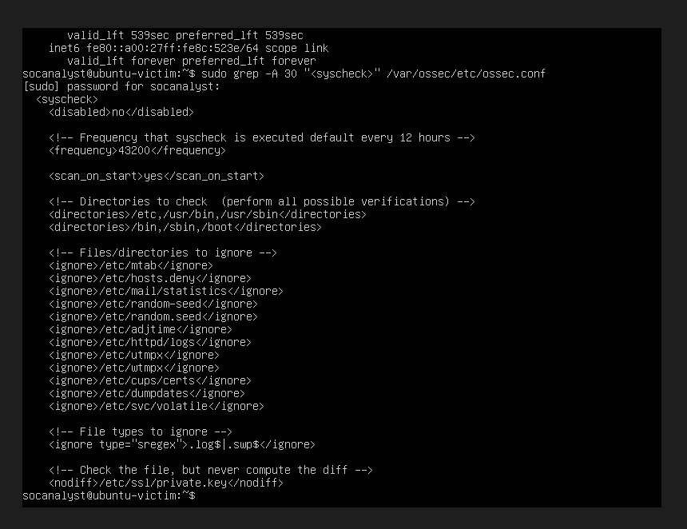
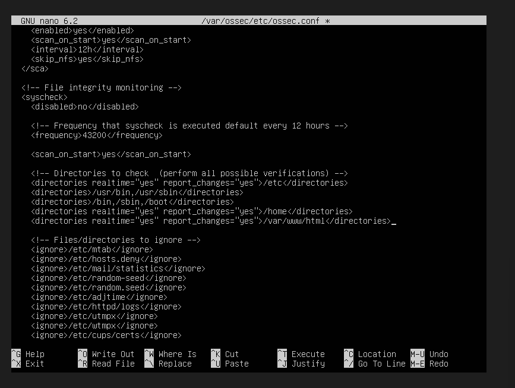
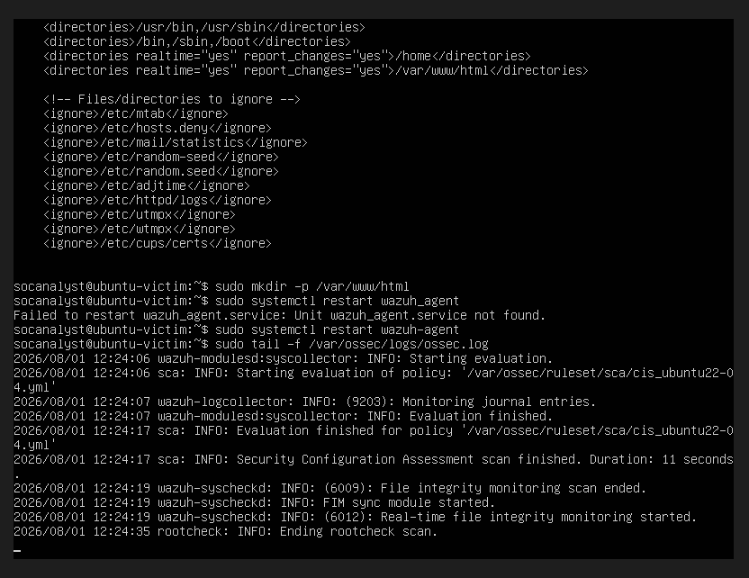
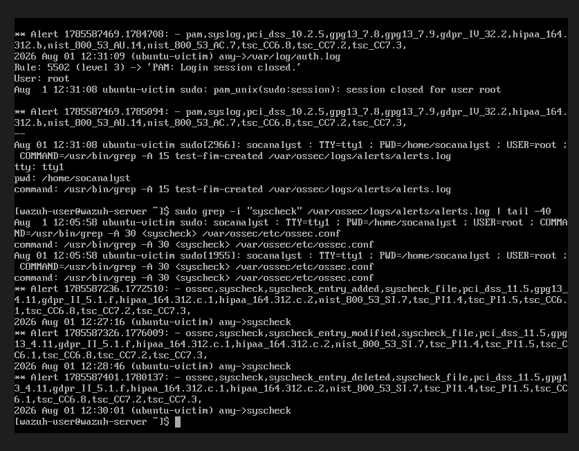
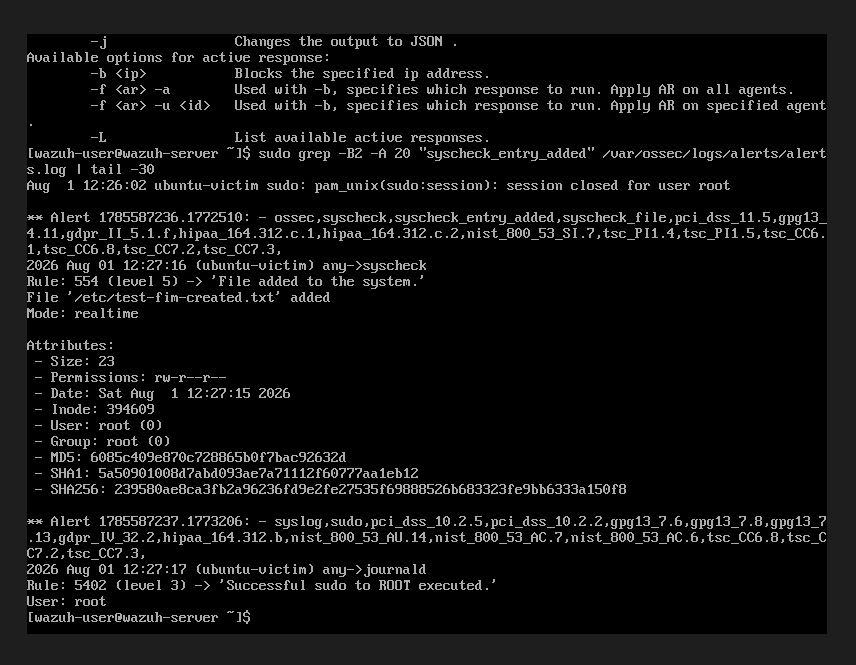
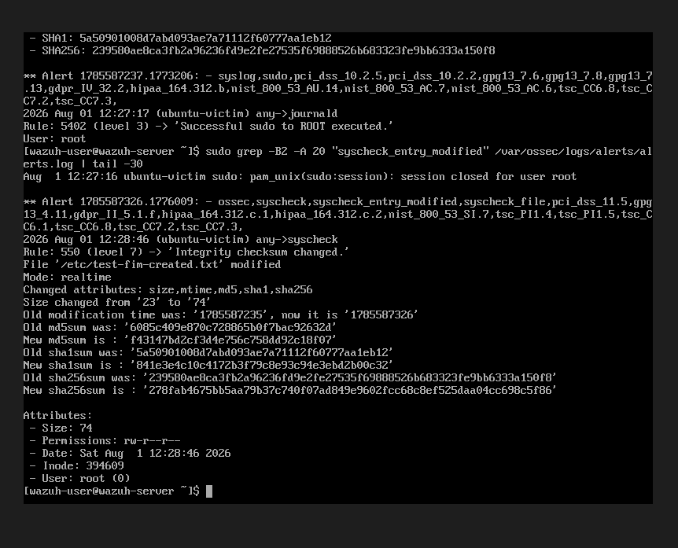
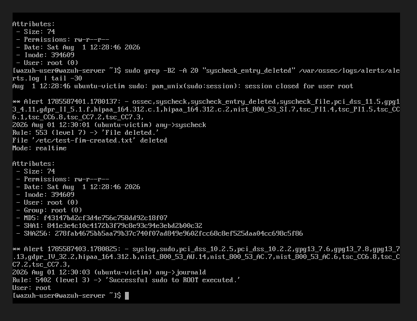
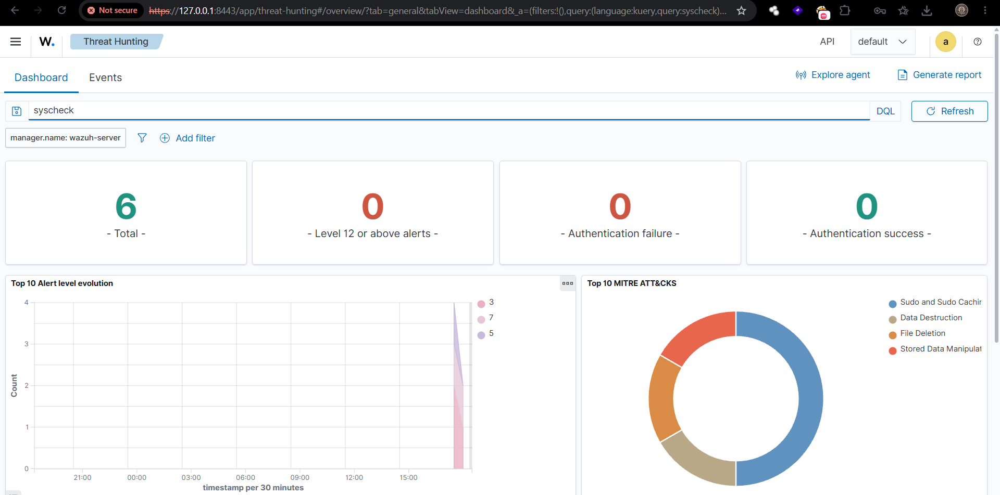
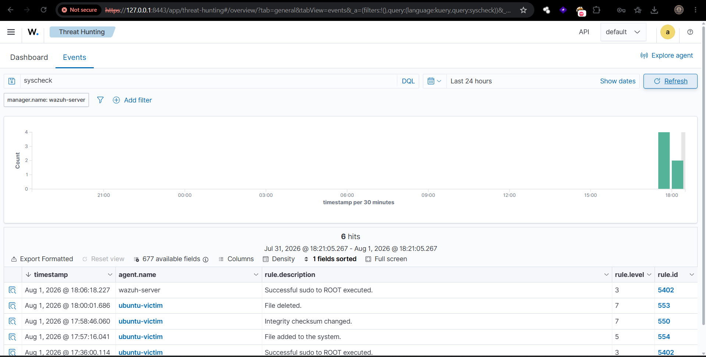

<div align="center">

# Phase 3 - File Integrity Monitoring (FIM)
### Endpoint Integrity Assurance via Real-Time Hash-Diff Verification

*A step-by-step record of configuring and validating Wazuh's built-in FIM (`syscheck`) module to monitor critical directories on the Ubuntu-Victim host, building on the SSH detection (Phase 1) and Active Response (Phase 2) capabilities already in place.*

---


</div>

---

## 🗺️ Architecture Diagram

<p align="center">
  
</p>

---

### 🔷 PHASE 3 — File Integrity Monitoring

| Step | Command(s) Used | Screenshot | Description |
|---|---|---|---|
| **1. Review Existing syscheck Configuration** | `sudo grep -A 30 "<syscheck>" /var/ossec/etc/ossec.conf` | [](../screenshots/phase3/Fig1.png) | Reviewed the Wazuh Agent's default FIM configuration on Ubuntu-Victim, confirming `/etc`, `/usr/bin`, `/usr/sbin`, `/bin`, `/sbin`, `/boot` were already monitored on a 12-hour scan cycle, with `scan_on_start` enabled. |
| **2. Extend Monitored Directories** | `sudo nano /var/ossec/etc/ossec.conf` *(added `realtime="yes" report_changes="yes"` to `/etc`; added new `<directories>` entries for `/home` and `/var/www/html`)* | [](../screenshots/phase3/Fig2.png) | Split the default `/etc` entry onto its own line with real-time (inotify-based) monitoring and content-diff reporting enabled, and added `/home` and `/var/www/html` as new realtime-monitored paths per the assignment scope. |
| **3. Create /var/www/html** | `sudo mkdir -p /var/www/html` | — | Ensured the web-root directory existed on the Victim so it could be validly monitored, without requiring a full Apache install. |
| **4. Restart Agent & Confirm Baseline Scan** | `sudo systemctl restart wazuh-agent`<br>`sudo tail -f /var/ossec/logs/ossec.log` | [](../screenshots/phase3/Fig4.png) | Verified clean agent restart with baseline FIM scan completing (`6009: scan ended`) followed by confirmation of real-time monitoring engine activation (`6012: Real-time file integrity monitoring started`). |
| **5. Demonstrate File Creation** | `echo "test file for FIM demo" \| sudo tee /etc/test-fim-created.txt` | — | Created a new file inside the monitored `/etc` directory to trigger an `added` FIM event via the active inotify watch. |
| **6. Demonstrate File Modification** | `echo "MODIFIED CONTENT - $(date)" \| sudo tee -a /etc/test-fim-created.txt` | — | Appended content to the same file to trigger a `modified` FIM event, changing its size and cryptographic hashes. |
| **7. Demonstrate File Deletion** | `sudo rm /etc/test-fim-created.txt` | — | Removed the file to trigger a `deleted` FIM event, completing the full lifecycle demonstration. |
| **8. Verify All Three Events on Manager** | `sudo grep -i "syscheck" /var/ossec/logs/alerts/alerts.log \| tail -40` | [](../screenshots/phase3/Fig8.png) | Confirmed all three lifecycle events reached the Manager and were correctly classified: `syscheck_entry_added`, `syscheck_entry_modified`, `syscheck_entry_deleted` — each tagged with PCI DSS, GDPR, HIPAA, and NIST compliance mappings. |
| **9. Capture Full Alert Detail — File Added** | `sudo grep -B2 -A 20 "syscheck_entry_added" /var/ossec/logs/alerts/alerts.log` | [](../screenshots/phase3/Fig9.png) | Captured **Rule 554 (Level 5)** — *"File added to the system"* — with full attribute detail: MD5, SHA1, SHA256 hashes, size, permissions, owner, and inode of the new file. |
| **10. Capture Full Alert Detail — File Modified** | `sudo grep -B2 -A 20 "syscheck_entry_modified" /var/ossec/logs/alerts/alerts.log` | [](../screenshots/phase3/Fig10.png) | Captured **Rule 550 (Level 7)** — *"Integrity checksum changed"* — showing a direct before/after comparison: size changed from 23 to 74 bytes, with old and new MD5, SHA1, and SHA256 hashes explicitly logged side by side. |
| **11. Capture Full Alert Detail — File Deleted** | `sudo grep -B2 -A 20 "syscheck_entry_deleted" /var/ossec/logs/alerts/alerts.log` | [](../screenshots/phase3/Fig11.png) | Captured **Rule 553 (Level 7)** — *"File deleted"* — confirming the alert retained the file's last known hash state as forensic evidence even after removal. |
| **12. Verify in Dashboard — Summary View** | *(Dashboard)* **Threat Hunting → Dashboard** → Search: `syscheck` | [](../screenshots/phase3/Fig12.png) | Confirmed 6 total hits with a MITRE ATT&CK breakdown correctly categorizing the activity under **File Deletion**, **Data Destruction**, **Stored Data Manipulation**, and **Sudo and Sudo Caching**. |
| **13. Verify in Dashboard — Event Timeline** | *(Dashboard)* **Threat Hunting → Events** → Search: `syscheck` | [](../screenshots/phase3/Fig13.png) | Final verification: clean chronological event list showing all three FIM alerts (Rules 554, 550, 553) correctly attributed to `agent.name: ubuntu-victim`, confirming the full detection pipeline from filesystem change to Dashboard visualization. |

---

### 📊 FIM Rule Reference Table

| Rule ID | Level | Description | Event Type | Compliance Mappings |
|---|---|---|---|---|
| 554 | 5 | File added to the system | `syscheck_entry_added` | PCI DSS 11.5, GDPR II_5.1.f, HIPAA 164.312.c.1/c.2, NIST SI.7 |
| 550 | 7 | Integrity checksum changed | `syscheck_entry_modified` | PCI DSS 11.5, GDPR II_5.1.f, HIPAA 164.312.c.1/c.2, NIST SI.7 |
| 553 | 7 | File deleted | `syscheck_entry_deleted` | PCI DSS 11.5, GDPR II_5.1.f, HIPAA 164.312.c.1/c.2, NIST SI.7 |

---

### 🔧 Key Configuration Reference

```xml
<syscheck>
  <disabled>no</disabled>
  <frequency>43200</frequency>
  <scan_on_start>yes</scan_on_start>

  <directories realtime="yes" report_changes="yes">/etc</directories>
  <directories>/usr/bin,/usr/sbin</directories>
  <directories>/bin,/sbin,/boot</directories>
  <directories realtime="yes" report_changes="yes">/home</directories>
  <directories realtime="yes" report_changes="yes">/var/www/html</directories>

  <!-- default <ignore> and <nodiff> exclusions retained unchanged -->
</syscheck>
```

**Why `realtime="yes"`:** Uses Linux's inotify kernel subsystem for immediate change detection, rather than waiting for the next scheduled 12-hour scan — essential for lab demonstration and genuinely valuable in production for high-sensitivity paths.

**Why `report_changes="yes"`:** Captures a diff of actual file content changes (not just "hash changed"), producing the before/after hash comparison shown in Fig 56 — critical for SOC investigation, since an analyst needs to know *what* changed, not just *that* something changed.

---

<div align="center">

*Built with 🔐 for learning — by a future SOC analyst.*

</div>
