---
## 📸 Phase 4 Procedure & Screenshots — Custom Wazuh Rules

A step-by-step record of writing, troubleshooting, and validating three custom Wazuh detection rules, extending the platform's default ruleset with detection logic authored specifically for this lab.

---

## 🗺️ Architecture Diagram

<p align="center">
  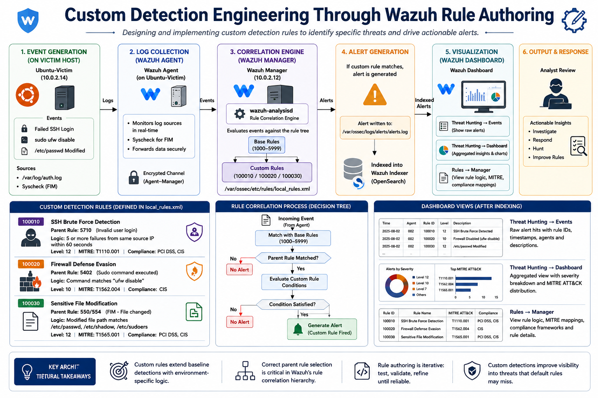
</p>

---

### 🔷 PHASE 4 — Custom Wazuh Rules
| Step | Command(s) Used | Screenshot | Description |
|---|---|---|---|
| **1. Review Custom Rules File & Convention** | `sudo cat /var/ossec/etc/rules/local_rules.xml` | [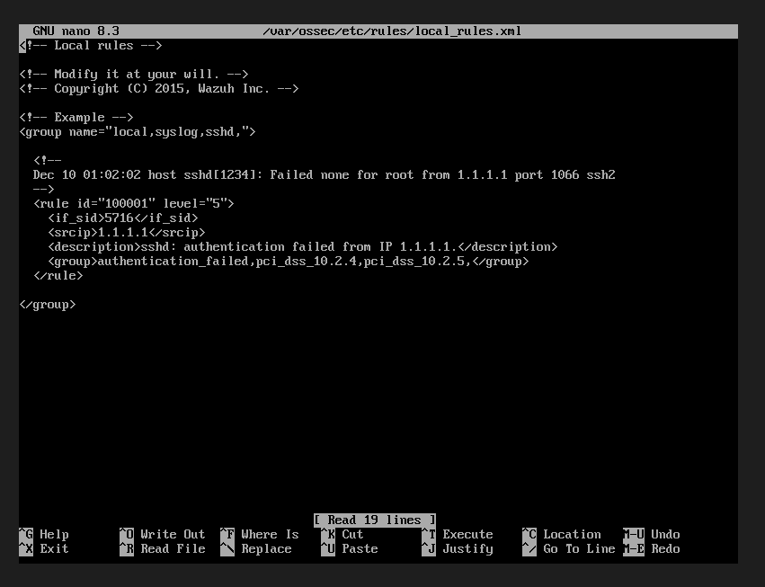](../screenshots/phase4/Fig1.png) | Reviewed Wazuh's dedicated `local_rules.xml` file (separate from vendor ruleset files to survive future updates), noting the default example rule at ID `100001` and confirming the `100000+` ID convention reserved for custom/local rules. |
| **2. Write Custom Rule 1 — SSH Brute Force** | `sudo nano /var/ossec/etc/rules/local_rules.xml` *(added Rule 100010, level 10)* | [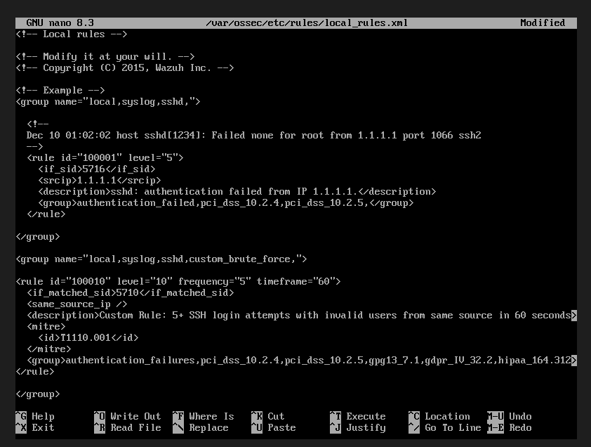](../screenshots/phase4/Fig2.png) | Authored a correlation rule using `if_matched_sid`, `frequency="5"`, `timeframe="60"`, and `same_source_ip` to detect 5+ invalid-user SSH attempts from a single source within 60 seconds—a tighter, self-authored alternative to the default frequency rule (5551) validated in Phase 1. |
| **3. Write Custom Rule 2 — Firewall Stopped** | `sudo nano /var/ossec/etc/rules/local_rules.xml` *(added Rule 100020, level 12)* | [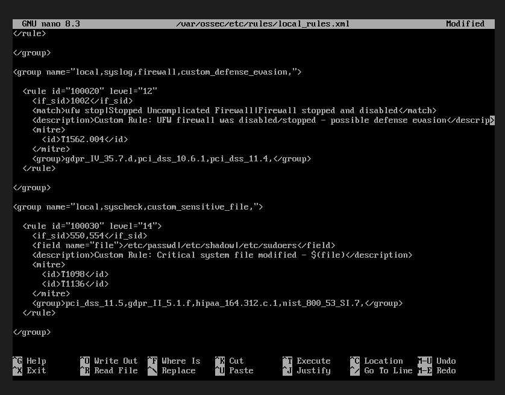](../screenshots/phase4/Fig3.png) | Authored a defense-evasion detection rule targeting UFW being disabled via privileged command execution, mapped to MITRE ATT&CK **T1562.004** (*Impair Defenses: Disable or Modify System Firewall*). |
| **4. Write Custom Rule 3 — Sensitive File Modified** | `sudo nano /var/ossec/etc/rules/local_rules.xml` *(added Rule 100030, level 14)* | [](../screenshots/phase4/Fig4.png) | Authored a high-fidelity FIM correlation rule using `if_sid 550,554` and `field name="file"` regex to detect changes to `/etc/passwd`, `/etc/shadow`, or `/etc/sudoers`, mapped to MITRE **T1098** and **T1136**. |
| **5. Validate XML Structure** | `sudo grep -c "<rule id=" /var/ossec/etc/rules/local_rules.xml`<br>`sudo grep -c "</rule>"`<br>`sudo grep -n "<rule id=" /var/ossec/etc/rules/local_rules.xml` | [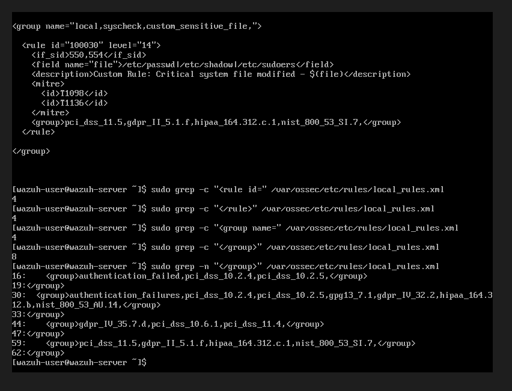](../screenshots/phase4/Fig5.png) | Confirmed four rule definitions (`100001`, `100010`, `100020`, `100030`) were present before restarting the Manager. |
| **6. Diagnose Manager Restart Failure** | `sudo systemctl restart wazuh-manager`<br>`sudo systemctl status wazuh-manager --no-pager`<br>`sudo tail -30 /var/ossec/logs/ossec.log` | [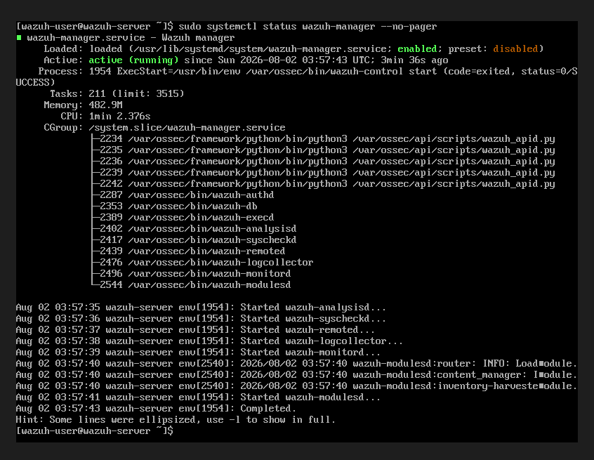](../screenshots/phase4/Fig6.png) | Encountered a configuration error during restart (`XMLERR: Attribute '<if_sid' has no value, line 38`) and used Wazuh's analysis output to identify the failing XML section. |
| **7. Identify Root Cause** | `sudo sed -n '35,42p' /var/ossec/etc/rules/local_rules.xml`<br>`sudo cat -A /var/ossec/etc/rules/local_rules.xml \| sed -n '30,42p'` | [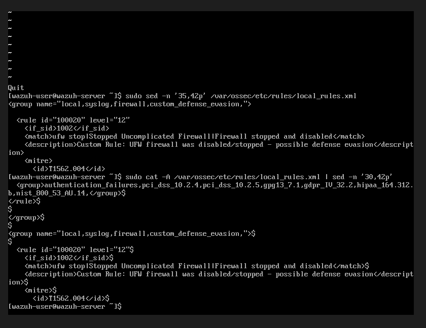](../screenshots/phase4/Fig7.png) | Identified the root cause: Rule `100020` was missing the closing `>` on the opening `<rule>` tag, causing subsequent XML elements to be interpreted as malformed attributes. |
| **8. Correct the Malformed Rule & Restart** | `sudo nano /var/ossec/etc/rules/local_rules.xml` *(added missing `>`)*<br>`sudo /var/ossec/bin/wazuh-analysisd -t`<br>`sudo systemctl restart wazuh-manager`<br>`sudo systemctl status wazuh-manager --no-pager` | [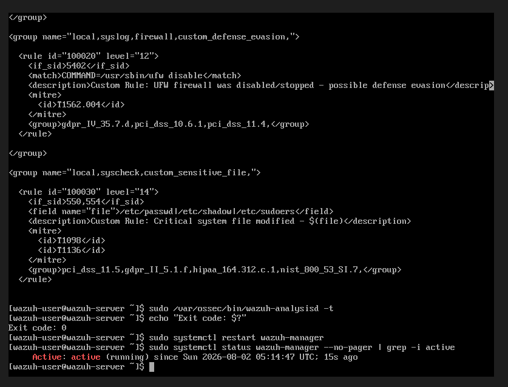](../screenshots/phase4/Fig8.png) | Corrected the XML syntax, validated the configuration using `wazuh-analysisd -t`, and confirmed a clean Manager restart with no XML or critical errors. |
| **9. Test Rule 100010 — SSH Brute Force** | `for i in {1..6}; do ssh baduser@127.0.0.1; done` *(run locally on Ubuntu-Victim)* | [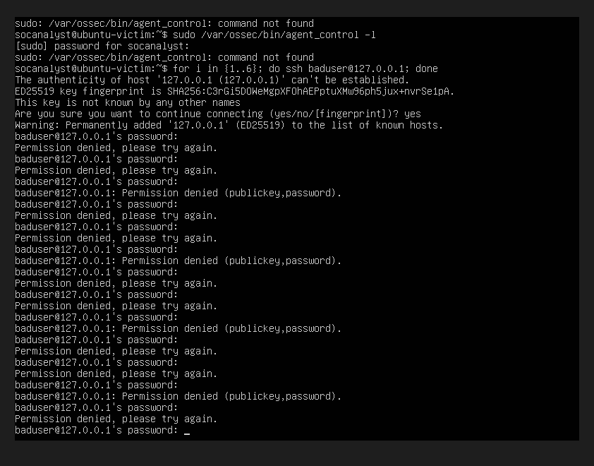](../screenshots/phase4/Fig9.png) | Simulated repeated failed SSH logins against the local host, generating authentication failures for the custom brute-force correlation rule. |
| **10. Test Rule 100020 — Firewall Disabled** | `sudo ufw disable`<br>`sudo ufw enable` | [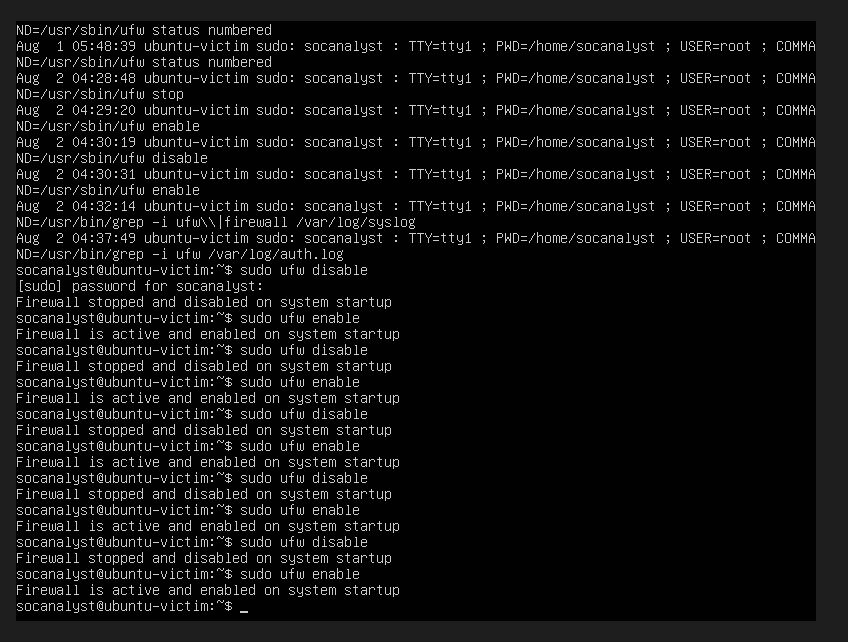](../screenshots/phase4/Fig10.png) | Disabled and re-enabled UFW to validate the custom firewall monitoring rule. After correcting the log source, the rule successfully detected both events. |
| **11. Test Rule 100030 — Sensitive File Modified** | `sudo md5sum /etc/passwd` *(baseline)*<br>`sudo nano /etc/passwd` *(append blank line)*<br>`sudo md5sum /etc/passwd` | [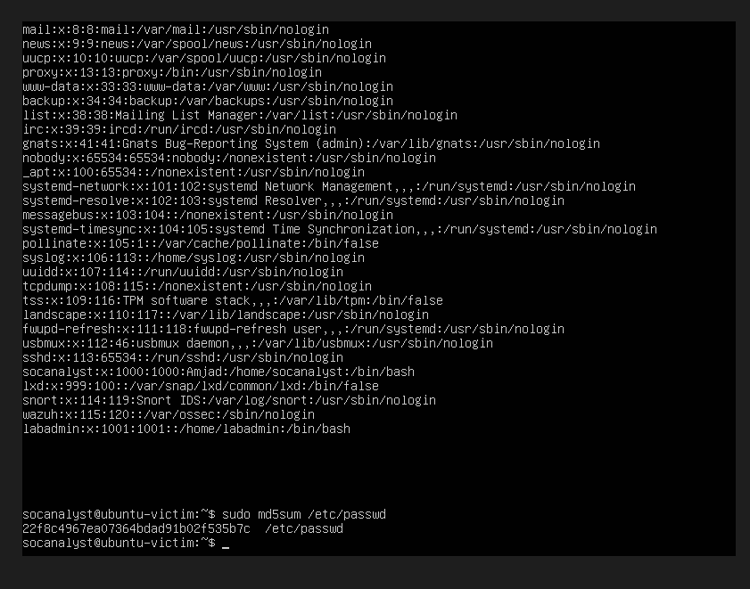](../screenshots/phase4/Fig11.png) | Made a safe, non-destructive modification to `/etc/passwd` to change its checksum and trigger the sensitive-file monitoring rule. |
| **12. Verify Fired Rules in alerts.log** | `sudo grep "Rule: 100010" /var/ossec/logs/alerts/alerts.log`<br>`sudo grep "Rule: 100020" /var/ossec/logs/alerts/alerts.log`<br>`sudo grep "Rule: 100030" /var/ossec/logs/alerts/alerts.log` | [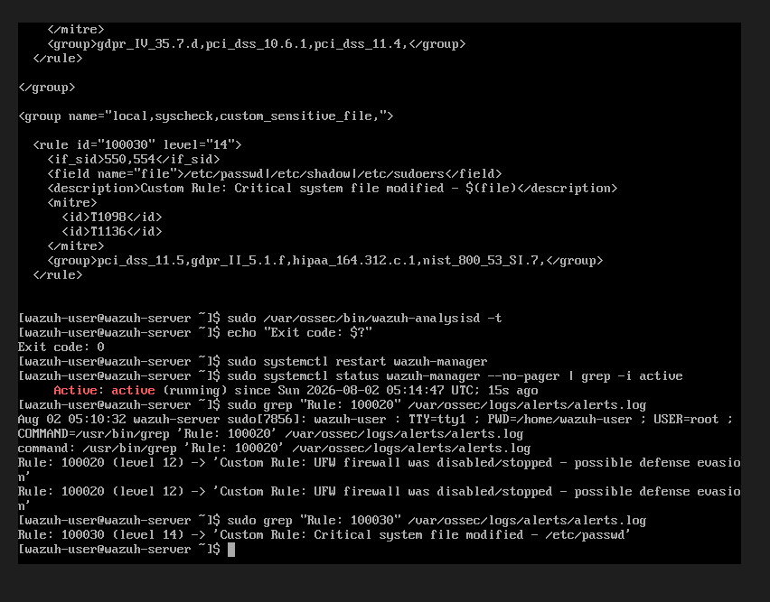](../screenshots/phase4/Fig12.png) | Confirmed all three custom rules generated alerts on the Wazuh Manager with the expected descriptions, severity levels, and MITRE mappings. |
| **13. Verify in Dashboard** | *(Dashboard)* **Threat Hunting → Events** → Search: `rule.id: (100010 OR 100020 OR 100030)` | [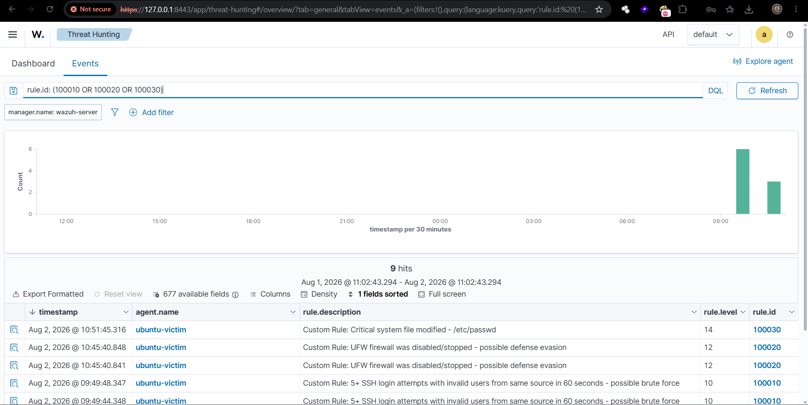](../screenshots/phase4/Fig13.png) | Verified all custom rule alerts appeared in the Wazuh Dashboard with correct rule IDs, severity levels, descriptions, and agent information. |
| **14. Verify Rule Definitions in Rules Manager** | *(Dashboard)* **Rules → Manager** → Search: `100010`, `100020`, `100030` | [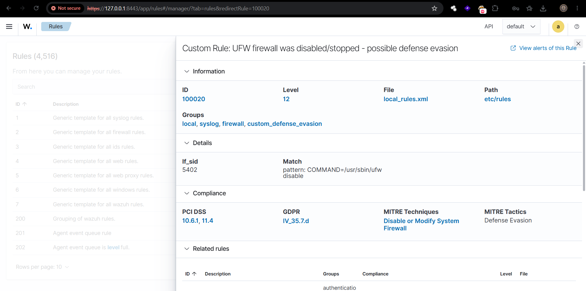](../screenshots/phase4/Fig14.png) | Verified Wazuh correctly parsed and displayed all three custom rules, including their conditions, MITRE ATT&CK mappings, and compliance metadata. |
| **15. Dashboard Summary View** | *(Dashboard)* **Threat Hunting → Dashboard** *(same filter)* | [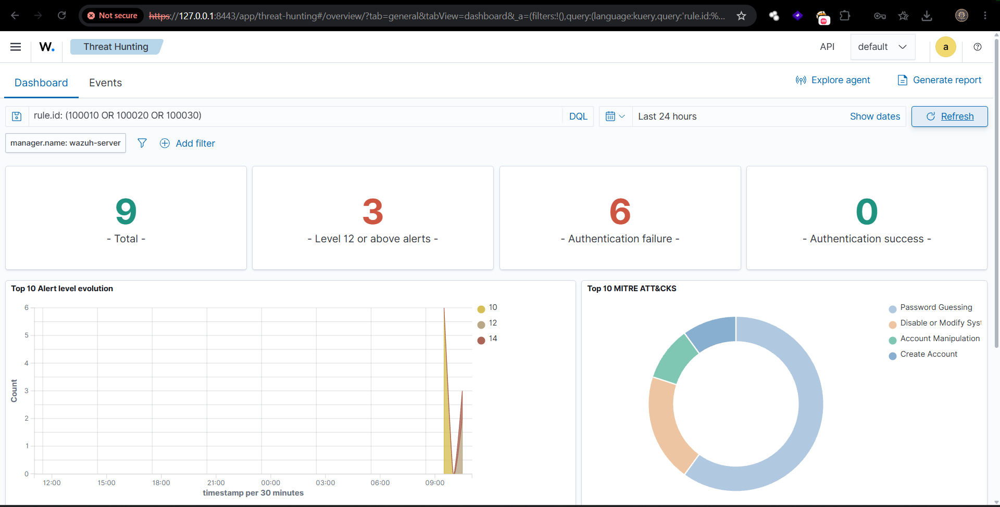](../screenshots/phase4/Fig15.png) | Final validation showing aggregated detections generated by the custom rules, including alert counts, severity distribution, and MITRE ATT&CK visualization. |

---

### 📊 Custom Rule Reference Table — Final Results

| Rule ID | Level | Purpose | Trigger Logic | MITRE ATT&CK | Status |
|---|---|---|---|---|---|
| 100010 | 10 | Custom SSH brute-force detection | `if_matched_sid 5710`, `frequency="5" timeframe="60"`, `same_source_ip` | T1110.001 (Password Guessing) | ✅ Confirmed — fired 5x |
| 100020 | 12 | Firewall (UFW) disabled — defense evasion | `if_sid 5402`, `match="COMMAND=/usr/sbin/ufw disable"` | T1562.004 (Disable or Modify System Firewall) | ✅ Confirmed — fired 2x (after fix, see below) |
| 100030 | 14 | Sensitive file modified (passwd/shadow/sudoers) | `if_sid 550,554`, `field name="file"` regex | T1098, T1136 (Account Manipulation / Create Account) | ✅ Confirmed — fired 1x, first attempt |

---

### 🛠️ Troubleshooting Log (documented engineering, not hidden)

**Issue 1 — XML Parse Failure on Initial Restart**
`wazuh-analysisd` failed to load `local_rules.xml` with `XMLERR: Attribute '<if_sid' has no value (line 38)`. Root cause: Rule 100020's opening `<rule id="100020" level="12"` tag was missing its closing `>`. Because the tag was never closed, the parser remained inside it when it reached the next line and misread `<if_sid>` as an unclosed attribute rather than a child element. **Fix:** added the missing `>`. **Lesson:** line numbers reported by XML parsers on multi-tag files can be misleading — the true defect is often one or two lines earlier than reported.

**Issue 2 — Rule 100020 Not Firing Despite Correct Log Content**
After the XML fix, Rule 100020 still failed to trigger on a real `ufw disable` event, even though the underlying sudo/auth log line was confirmed present in `alerts.log`. Root cause: the rule was configured as a child of the generic syslog base rule (`if_sid 1002`), while the actual event was already being classified and terminated under the more specific `Rule 5402: Successful sudo to ROOT executed`. **Fix:** reparented the custom rule to `if_sid 5402` and updated the match string to `COMMAND=/usr/sbin/ufw disable` (matching the exact `sudo` audit-log format on this system, rather than UFW's own inconsistently-logged CLI status messages). **Lesson:** Wazuh's rule tree evaluates events against the most specific matching parent; a custom rule built on an overly generic `if_sid` can be silently pre-empted by a more specific sibling rule matching first.

**Issue 3 — SSH Brute-Force Test Executed via Loopback**
The dedicated Kali attacker VM was unavailable at test time due to host resource constraints. Test 1 was executed as a local loopback attack (`ssh baduser@127.0.0.1` from Ubuntu-Victim itself) rather than from an external attacker host. This is noted as a controlled substitution: Wazuh's detection logic for this rule is based entirely on authentication log content and timing, not network topology, so the loopback test validates the same detection logic an external attack would. Repeating this test from Kali is recommended as future work for full network-layer validation.

---

### 🔧 Final Verified Rule Configuration

```xml
<group name="local,syslog,sshd,custom_brute_force,">
  <rule id="100010" level="10" frequency="5" timeframe="60">
    <if_matched_sid>5710</if_matched_sid>
    <same_source_ip />
    <description>Custom Rule: 5+ SSH login attempts with invalid users from same source in 60 seconds - possible brute force</description>
    <mitre><id>T1110.001</id></mitre>
    <group>authentication_failures,pci_dss_10.2.4,pci_dss_10.2.5,gpg13_7.1,gdpr_IV_32.2,hipaa_164.312.b,nist_800_53_AU.14,</group>
  </rule>
</group>

<group name="local,syslog,firewall,custom_defense_evasion,">
  <rule id="100020" level="12">
    <if_sid>5402</if_sid>
    <match>COMMAND=/usr/sbin/ufw disable</match>
    <description>Custom Rule: UFW firewall was disabled/stopped - possible defense evasion</description>
    <mitre><id>T1562.004</id></mitre>
    <group>gdpr_IV_35.7.d,pci_dss_10.6.1,pci_dss_11.4,</group>
  </rule>
</group>

<group name="local,syscheck,custom_sensitive_file,">
  <rule id="100030" level="14">
    <if_sid>550,554</if_sid>
    <field name="file">/etc/passwd|/etc/shadow|/etc/sudoers</field>
    <description>Custom Rule: Critical system file modified - $(file)</description>
    <mitre><id>T1098</id><id>T1136</id></mitre>
    <group>pci_dss_11.5,gdpr_II_5.1.f,hipaa_164.312.c.1,nist_800_53_SI.7,</group>
  </rule>
</group>
```

---

### 📋 SOC Analysis Summary — All 3 Custom Detections

| Field | Rule 100010 | Rule 100020 | Rule 100030 |
|---|---|---|---|
| **Alert Name** | 5+ SSH login attempts with invalid users — possible brute force | UFW firewall disabled/stopped — possible defense evasion | Critical system file modified |
| **Severity** | Level 10 (High) | Level 12 (High) | Level 14 (Critical) |
| **Source** | 127.0.0.1 (loopback simulation) | Ubuntu-Victim (local action) | Ubuntu-Victim (local action) |
| **Destination/Target** | Ubuntu-Victim SSH service | Ubuntu-Victim host firewall | /etc/passwd |
| **MITRE ATT&CK** | T1110.001 — Password Guessing | T1562.004 — Impair Defenses | T1098 / T1136 — Account Manipulation / Create Account |
| **Impact** | Potential credential compromise via guessing; precursor to account takeover | Host firewall protection removed; exposes system to unrestricted traffic | Possible unauthorized account creation or credential tampering |
| **Recommended Action** | Active Response IP block, enforce SSH key-only auth, account lockout policy | Auto re-enable via Active Response, alert analyst immediately, review responsible session | Immediate diff review, cross-reference recent auth logs, verify against change requests |

---

*Phase 4 complete — all three custom rules authored, XML-validated, restart-tested, trigger-tested, and confirmed via both CLI (`alerts.log`) and Wazuh Dashboard (Events table, Rules Manager, and Summary Dashboard). This continues the Fig sequence from Phase 3 (Fig 51–59); Phase 4 spans Fig 60–74. Replace screenshot filenames above with your actual captured images before final submission.*
