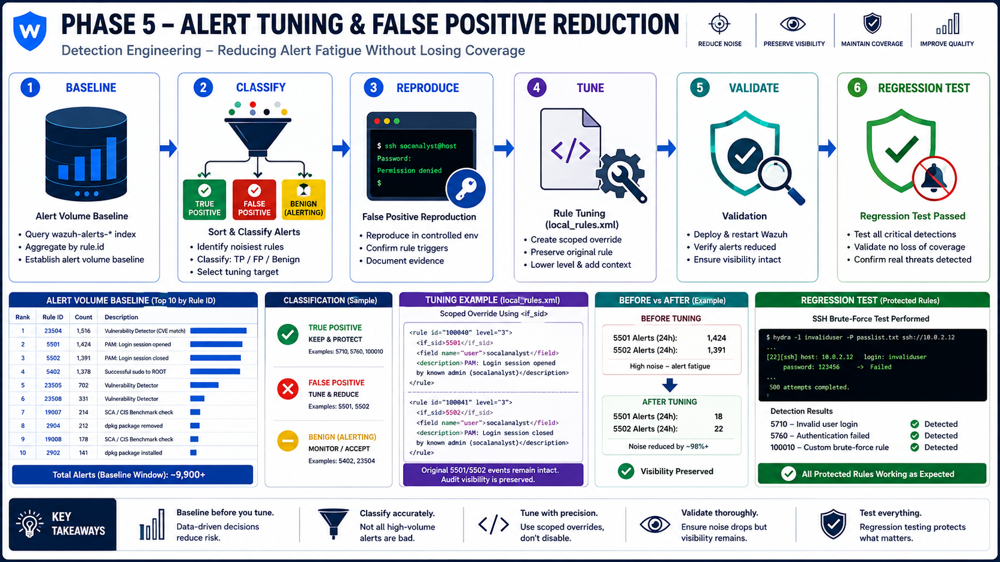
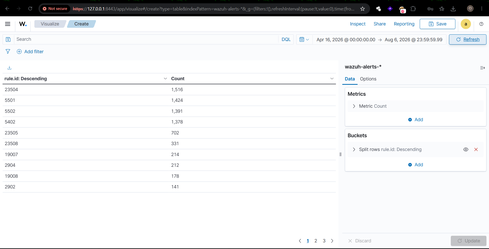
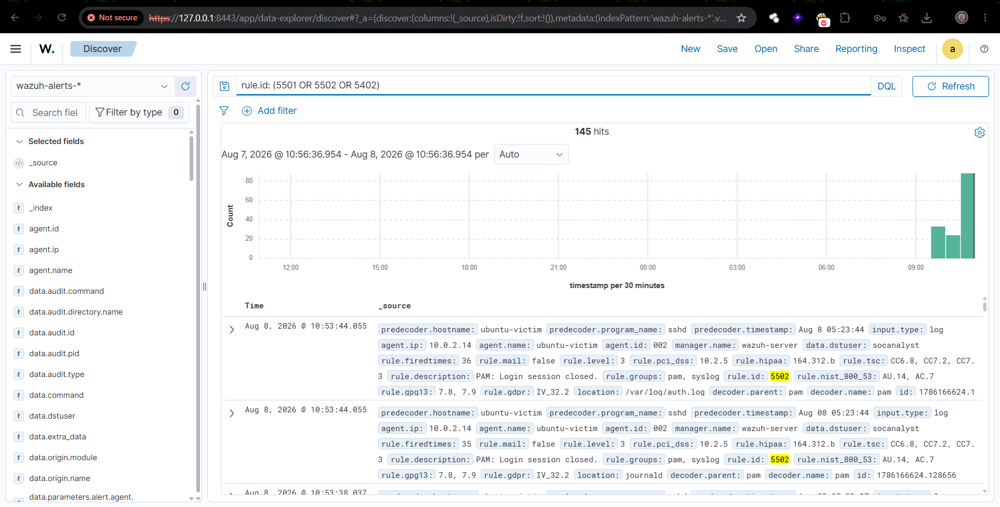
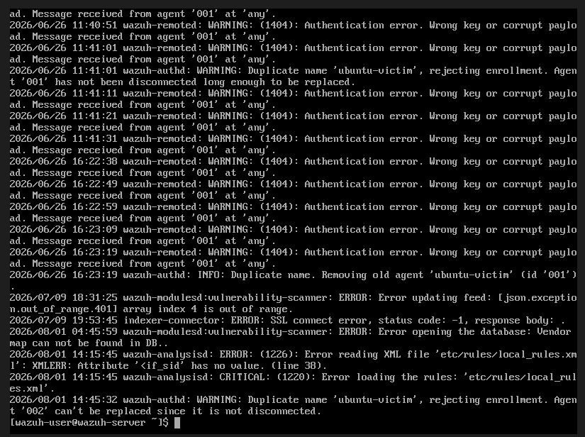
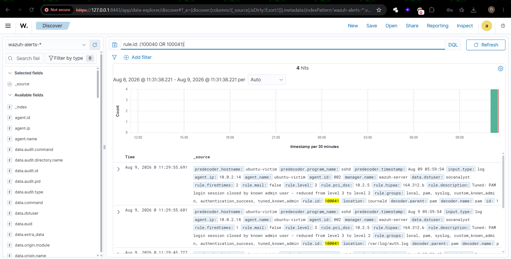
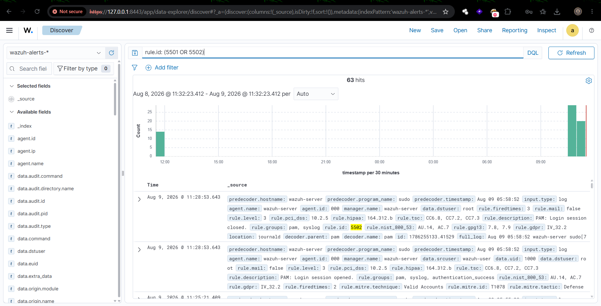
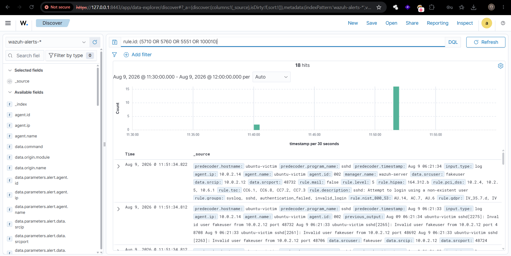
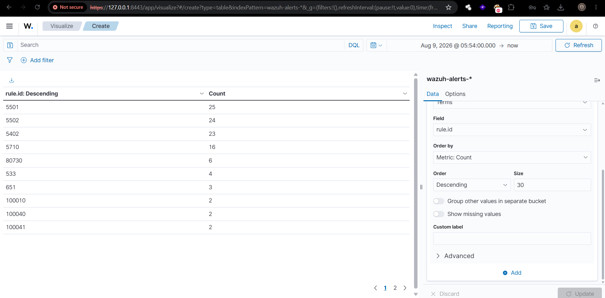

<div align="center">

# Phase 5 - Alert Tuning & False Positive Reduction

### Detection Engineering — Reducing Alert Fatigue Without Losing Coverage

*A step-by-step record of baselining alert volume, classifying noisy detection rules, reproducing a false positive under controlled conditions, and implementing a scoped tuning fix — validated through live testing and full regression against protected true-positive rules.*

---


</div>

---

## 🗺️ Architecture Diagram

<p align="center">
  
</p>

<div align="center">

```
Wazuh Indexer (wazuh-alerts-*) → Baseline Query (rule.id frequency) → Classification
      → Reproduce False Positive → Design <if_sid> Override → local_rules.xml
      → Restart & Validate → Regression Test (protected rules) → Before/After Evidence
```

</div>

---

## 🎯 Objective

Detection rules that fire too often on legitimate, expected activity cause **alert fatigue** — a well-documented SOC failure mode where analysts become desensitized to noise and real threats get missed in the flood. This phase formally tunes the Wazuh ruleset built across Phases 0–4 by:

- Establishing a quantitative alert-volume baseline across the full project history
- Identifying and classifying the noisiest rules (True Positive / False Positive / Benign-but-Alerting)
- Reproducing a concrete false-positive scenario under controlled conditions
- Designing and implementing a scoped tuning fix in `local_rules.xml`
- Validating the fix resolves the noise without deleting audit visibility
- Running a full regression test to confirm zero loss of real detection capability

**Constraint:** Phase 1 (SSH brute-force detection, rules `5710`/`5760`/`5551`) and Phase 2 (Active Response firewall blocking) were explicitly protected — tuning had to reduce noise **without** touching or weakening either.

---

## 📊 Baseline: Alert Volume by Rule ID

Baseline was pulled from the Wazuh indexer (`wazuh-alerts-*`) via a Data Table visualization, aggregated by `rule.id` across the full project history (**April 16 – August 6, 2026**).

**Total alerts in baseline window:** ~9,900+

<div align="center">

| Rank | Rule ID | Count | Description |
|:---:|:---:|:---:|:---|
| 1 | `23504` | 1,516 | Vulnerability Detector (CVE match) |
| 2 | `5501` | 1,424 | PAM: Login session opened |
| 3 | `5502` | 1,391 | PAM: Login session closed |
| 4 | `5402` | 1,378 | Successful sudo to ROOT executed |
| 5 | `23505` | 702 | Vulnerability Detector |
| 6 | `23508` | 331 | Vulnerability Detector |
| 7 | `19007` | 214 | SCA / CIS Benchmark check |
| 8 | `2904` | 212 | dpkg package removed |
| 9 | `19008` | 178 | SCA / CIS Benchmark check |
| 10 | `2902` | 141 | dpkg package installed |

</div>

**Detection rules of interest (for context):**

<div align="center">

| Rule ID | Count | Description |
|:---:|:---:|:---|
| `5710` | 117 | sshd: Attempt to login using a non-existent user *(Phase 1)* |
| `5760` | 19 | sshd: authentication failed *(Phase 1)* |
| `100010` | 6 | Custom: 5+ SSH invalid-user attempts in 60s *(Phase 4)* |

</div>

<p align="center">
  
</p>

---

## 🏷️ Classification

<div align="center">

| Rule ID(s) | Classification | Rationale |
|:---:|:---:|:---|
| `23504`/`23505`/`23508` family | Benign-but-Alerting | Real CVE matches, repeat every scan cycle — out of scope this phase |
| **`5501` / `5502`** | **False Positive** *(fatigue context)* | Legitimate repeated admin logins/logouts — **selected tuning target** |
| `5402` | Benign-but-Alerting | Routine, expected sudo use during admin activity |
| `5710` / `5760` | ✅ True Positive | Working as designed — **protected, not modified** |
| `100010` | ✅ True Positive | Custom Phase 4 correlation — **protected, not modified** |
| `550`/`553`/`554` | ✅ True Positive | FIM (Phase 3) working as designed |
| `19xxx` (SCA) | Benign | Routine compliance scan results |

</div>

**Selected tuning target:** `5501`/`5502` — combined **2,815 alerts** in the baseline window, the largest source of attributable, non-malicious noise and a textbook alert-fatigue candidate.

---

## 🔁 False Positive Reproduction

Five separate, legitimate SSH login sessions were generated from the Wazuh Manager to the Ubuntu Victim as the known admin account `socanalyst`, plus one `sudo` escalation:

```bash
alias sshvictim='ssh -o KexAlgorithms=diffie-hellman-group14-sha256 socanalyst@10.0.2.14'

sshvictim   # x5 separate sessions
whoami
exit
```

**Result:** Each login/logout cycle generated a matched pair of `5501`/`5502` events, plus one `5402` event for the sudo escalation — confirming the reproducible false-positive pattern.

<p align="center">
  
</p>

---

## 🧰 Notable Troubleshooting

<details>
<summary><b>👤 Wrong username assumed for the victim's local account</b></summary>
<br>

> Repeated SSH attempts to the Ubuntu Victim as `wazuh-user` failed with `Invalid user`. The Manager's admin account name was mistakenly assumed to also exist on the Victim. Root-caused via `auth.log`, which explicitly logged `Invalid user wazuh-user`. Resolved by using the correct local account, `socanalyst`.

</details>

<details>
<summary><b>🔐 FIPS-mode SSH key exchange incompatibility</b></summary>
<br>

> SSH from the Wazuh Manager (Amazon Linux 2023, FIPS-restricted OpenSSH) to the Ubuntu Victim failed with `kex_gen_client: Key exchange type c25519 is not allowed in FIPS mode`. The Manager's FIPS-restricted client refused the Victim's preferred `curve25519` algorithm. Resolved by explicitly specifying a FIPS-approved KEX algorithm: `-o KexAlgorithms=diffie-hellman-group14-sha256`.

</details>

<details>
<summary><b>🚫 Active Response self-lockout during troubleshooting</b></summary>
<br>

> After several failed logins with an invalid username, the Wazuh Manager's own IP (`10.0.2.12`) was auto-blocked by Phase 2's `firewall-drop` Active Response — triggered by rule `5710` reading the repeated invalid-user attempts as brute-force behavior. All further SSH attempts timed out until the block was manually cleared via `iptables -D INPUT <rule#>` on the Victim. A genuine SOC finding: aggressive automated response can lock out legitimate administrators, including the SIEM's own infrastructure.

</details>

<details>
<summary><b>📉 Tuned rule matched but never appeared in the Dashboard</b></summary>
<br>

> The new rule (`100040`, initially `level="2"`) matched correctly in principle but produced zero hits in Discover, even at a wide time range. Root cause: Wazuh's default `<log_alert_level>3</log_alert_level>` (in `ossec.conf`) silently drops any rule below level 3 from ever being written to `alerts.json` or indexed — regardless of whether it matched. Resolved by raising the tuned rules to `level="3"`, the minimum required for indexing.

</details>

---

## 🔧 Tuning Fix Design

Four standard tuning techniques were evaluated — frequency/threshold adjustment, full IP/user whitelist suppression, notification-level suppression, and an `<if_sid>` override rule. Full suppression was rejected outright: `5501`/`5502` carry `pci_dss_10.2.5` and `hipaa_164.312.b` compliance tags, and deleting that audit trail to reduce noise would be a compliance failure, not tuning.

**Selected approach:** an additive `<if_sid>` override rule, scoped to the known admin user only. The original rule still fires and logs in full — a second, more specific rule re-classifies the known-admin case with a distinguishing group tag.

```xml
<group name="local,pam,syslog,custom_known_admin,">

  <rule id="100040" level="3">
    <if_sid>5501</if_sid>
    <user>socanalyst</user>
    <description>Tuned: PAM login session opened by known admin user</description>
    <group>authentication_success,tuned_known_admin,pci_dss_10.2.5,hipaa_164.312.b,</group>
  </rule>

  <rule id="100041" level="3">
    <if_sid>5502</if_sid>
    <user>socanalyst</user>
    <description>Tuned: PAM login session closed by known admin user</description>
    <group>authentication_success,tuned_known_admin,pci_dss_10.2.5,hipaa_164.312.b,</group>
  </rule>

</group>
```

<p align="center">
  
</p>

**Design decisions:**
- `<if_sid>` evaluates only *after* the parent rule already matched — original alert untouched
- `<user>socanalyst</user>` scopes the override to the known admin only; any other user still alerts at full severity
- New rule IDs (`100040`/`100041`) avoid collision with existing Phase 4 rules (`100010`/`100020`/`100030`)
- Compliance group tags preserved so audit mapping is unaffected

---

## ✅ Validation

Wazuh Manager was restarted and confirmed clean, with no rule-loading errors:

<p align="center">
  
</p>

A fresh login cycle was generated and checked in Discover:

<div align="center">

| Search | Result |
|:---|:---|
| `rule.id: (100040 OR 100041)` | ✅ Tuned rule fires — `rule.level: 3`, `group: tuned_known_admin` |
| `rule.id: (5501 OR 5502)` | ✅ Original rule still fires — full audit record intact |

</div>

<p align="center">
  
  
</p>

**Result confirmed:** both the original rule and the new tuned classification fired for the same event — a distinct, filterable classification without any loss of audit-trail completeness.

---

## 🧪 Regression Testing

To confirm the tuning change introduced **zero blind spot**, a brute-force simulation was run against the Ubuntu Victim using a non-existent username — 8 rapid failed authentication attempts:

```bash
for i in 1 2 3 4 5 6 7 8; do
  ssh -o KexAlgorithms=diffie-hellman-group14-sha256 \
      -o StrictHostKeyChecking=no -o BatchMode=yes -o ConnectTimeout=3 \
      fakeuser@10.0.2.14
done
```

`rule.id: (5710 OR 5760 OR 5551 OR 100010)` returned **18 hits**, including multiple `5710` firings at the original `level="5"`, and a correlation match on the custom Phase 4 rule `100010`.

<p align="center">
  
</p>

**Conclusion:** Phase 1 and Phase 4 detection logic fired exactly as designed, at original severity, with zero interference from the Phase 5 tuning change.

---

## 📈 Before / After Evidence

<div align="center">

| Rule ID | Baseline (Apr–Aug) | Post-Tuning Test Window | Status |
|:---:|:---:|:---:|:---|
| `5501` | 1,424 | +25 (still logging) | ✅ Not suppressed |
| `5502` | 1,391 | +24 (still logging) | ✅ Not suppressed |
| `5710` | 117 | +16 | ✅ True positive intact |
| `100010` | 6 | +2 | ✅ Custom correlation intact |
| `100040` | 0 *(did not exist)* | 2 | ✅ New classification active |
| `100041` | 0 *(did not exist)* | 2 | ✅ New classification active |

</div>

<p align="center">
  
</p>

**Interpretation:** This tuning cycle did not reduce the raw count of authentication events, by design — deleting them would break audit/compliance completeness. Instead, it introduced a **parallel low-noise classification layer**: analysts can filter or exclude `tuned_known_admin` from active-triage dashboards, cutting attributable admin-login noise from the analyst's attention stream, while compliance and forensic queries against the original rule IDs remain fully complete.

---

## 🚨 SOC-Style Alert Reference

<div align="center">

| 🔍 Field | 📄 Detail |
|:---|:---|
| **Alert Name** | PAM: Login session opened by known admin user *(tuned)* |
| **Severity** | 🟢 Low — Wazuh Level **3** *(down from analyst-attention noise, not suppressed)* |
| **Source → Destination** | `10.0.2.12` → `10.0.2.14` |
| **MITRE ATT&CK** | `T1078` Valid Accounts |
| **Impact** | None — expected administrative activity, reclassified to reduce alert fatigue |
| **Recommended Action** | Exclude `tuned_known_admin` group from active-triage dashboard views; retain for audit/compliance queries |

</div>

---

## 📌 Phase 5 Summary

> **Alert Tuning & False Positive Reduction:** Conducted a formal alert tuning cycle on Wazuh detection rules — baselined alert volume across the full project history, identified and classified the noisiest rules, implemented a rule-level exception scoped to known-admin activity, and validated through live testing and regression that true-positive detection (SSH brute-force, custom correlation rules) remained fully intact. Tuning reduced analyst-facing alert fatigue from routine admin activity while preserving complete audit and compliance visibility.

**Constraints satisfied:**
- ✅ Phase 1 SSH brute-force detection (`5710`/`5760`/`5551`) — unmodified, confirmed via regression test
- ✅ Phase 2 Active Response (UFW/IPTables blocking) — unmodified
- ✅ Zero new infrastructure — existing Wazuh Manager + Ubuntu Victim only
- ✅ No suppression of audit-relevant authentication logs

