<div align="center">

# Phase 6 - n8n SOAR Orchestration Layer
### Workflow Automation for Wazuh Alert Enrichment & Notification

*A step-by-step, in-progress record of standing up a self-hosted n8n automation layer on top of the existing Wazuh-Snort pipeline, exposing it securely to the internet without a VPS or open inbound ports, and wiring it to Wazuh's native Active Response module for genuine automated triggering.*

---


</div>

---

## 🎯 Objective

Phases 0–5 built a complete detection, response, and tuning pipeline entirely within Wazuh + Snort. Phase 6 adds a genuine **SOAR orchestration layer** on top: when a high-severity Wazuh alert fires (rule `5710`/`100010`, SSH brute-force), an active-response script fires a webhook that triggers an [n8n](https://n8n.io) workflow that:

1. Receives and authenticates the alert payload
2. Enriches the source IP (geolocation via `ip-api.com`)
3. Formats a readable, analyst-friendly summary
4. Pushes a real-time notification to Discord

This closes the loop from *detection* → *automated triage support* → *human notification*, the core concept behind SOAR (Security Orchestration, Automation, and Response), while staying honest about the difference between this single-tool automation and a full cross-tool SOAR platform (see README's note on scope).

---

## 🖥️ Infrastructure Decision: Why No Third VM / No Cloud VPS

**Constraint:** 8GB RAM host, 2 existing VMs (Wazuh Manager, Ubuntu Victim) already running Snort + Wazuh Agent. A prior Wazuh Indexer OOM-kill incident (documented in Phase 0/1) made the team deliberately cautious about adding load.

**Options evaluated:**

| Option | Verdict |
|---|---|
| Docker Desktop / third local VM | ❌ Ruled out — insufficient host RAM headroom |
| Oracle Cloud Always Free (Ampere A1) | ❌ Ruled out — requires a credit card for identity verification, even though never billed; not available without one |
| n8n Cloud SaaS | ❌ Trial-only, not viable long-term for a portfolio project |
| Render / Railway free tier | ⚠️ Workable but cold-start delays undermine real-time alerting |
| **n8n self-hosted on existing Ubuntu Victim VM + Cloudflare Tunnel** | ✅ **Selected** |

**Rationale:** n8n installed via `npm` (not Docker) has a small footprint (~200Mi resident RAM measured in practice — see Memory Impact table below). Combined with Cloudflare Tunnel's **fully outbound-initiated** connection model, this avoids opening any inbound port on the lab network entirely — a stronger security posture than a traditional VPS + open firewall port, and a genuine architectural decision worth defending in review: *no listening port exists for an attacker to discover or scan*.

---

## 📊 Memory Impact — Empirically Validated

Given the prior OOM-kill history, every install step was memory-checked before and after.

<div align="center">

| Stage | Available RAM (`free -h`) |
|:---|:---:|
| Baseline (Snort + Wazuh Agent only, post security patch + reboot) | 967Mi |
| After Node.js 20.x install | 985Mi |
| After n8n install (idle, not running) | 1.0Gi |
| **With n8n actively running** | **767Mi** |
| Swap usage under load | 87Mi (of 2.1Gi — untouched majority) |

</div>

**n8n's real-world memory cost: ~200Mi.** Comfortably within budget, with ~750Mi headroom remaining and a full swap safety margin unused. n8n 2.x's process model was also observed and documented: it splits into a main process plus an isolated **task-runner subprocess** for workflow execution sandboxing — a defense-in-depth detail worth noting.

<p align="center">
  
</p>

> ⚠️ Note (added during Active Response integration): the memory picture above reflects Ubuntu-Victim only. During live Active Response testing, the Wazuh-Manager VM was separately found to be under real memory pressure — only 253Mi available with zero swap configured, causing intermittent SSH test failures and a misleading systemd "failed" status on restart. This was fully resolved (2GB swap added + a systemd TimeoutStartSec override), not just worked around — see Troubleshooting below. The two VMs' resource headroom is not symmetric, and this became a genuine testing bottleneck during this phase, not just a theoretical risk.

> ⚠️ Second note: disk space, not just RAM, proved to be a real constraint on this same Manager VM — a 25GB root volume was found completely full (100%) mid-session, traced to 17GB of stale Vulnerability Detector cache accumulated since April. See Troubleshooting below for the full diagnosis and cleanup. Worth flagging here alongside the memory note: on a long-running, resource-constrained lab VM, disk exhaustion is just as likely as RAM exhaustion, and neither announces itself clearly — both surfaced as confusing, seemingly-unrelated secondary symptoms before their real cause was found.

---

## 🔧 Build Log

### Step 1 — Security Patching (pre-work)

Before exposing any new service to the internet, the Ubuntu Victim VM's pending security updates were applied via a **dry-run-then-apply** process (`apt-get -s dist-upgrade` reviewed before real execution), specifically checking that no patch touched `snort` or `wazuh-agent` package versions. A kernel update was included (`5.15.0-185` → `5.15.0-191`), requiring a reboot; Snort and Wazuh Agent service health was verified both immediately pre-reboot and post-reboot to confirm no regression from the kernel bump.

### Step 2 — Node.js 20.x LTS Installation

Installed via the NodeSource repository (required — Ubuntu 22.04's default `apt` repo only carries Node 12.x, which is EOL and incompatible with n8n).

<p align="center">
  
</p>

### Step 3 — n8n Installation

```bash
sudo npm install -g n8n
```

Version installed: **2.8.4**. Install took ~17 minutes on this VM's constrained CPU allocation (1917 packages), a useful data point for planning future installs on similarly constrained hardware.

<p align="center">
  
</p>

### Step 4 — Cloudflare Tunnel Installation & Configuration

Installed via Cloudflare's official apt repository (`pkg.cloudflare.com`), version **2026.8.3**. Runs in **Quick Tunnel** mode (`cloudflared tunnel --url http://localhost:5678 --protocol http2`) — no Cloudflare account required, generates a random public `*.trycloudflare.com` HTTPS URL with a fully outbound connection to Cloudflare's edge.

**Known limitation (tracked, not yet resolved):** Quick Tunnel URLs are ephemeral — a new random URL is issued every time the `cloudflared` process restarts, requiring the service to be manually restarted each session (see Session Restart Procedure below). A **Named Tunnel** (requires free Cloudflare account + a domain) is the planned upgrade path for a persistent, production-style URL. Deferred as a later task since it doesn't block current build/test work.

<p align="center">
  
</p>

A significant mid-build obstacle was a broken DHCP-assigned DNS server preventing tunnel registration entirely (full root-cause narrative in Troubleshooting below); the permanent fix via a custom netplan override is confirmed working here:

<p align="center">
  
</p>

### Step 5 — n8n Webhook Node (Trigger)

End-to-end reachability was confirmed first by loading the n8n editor itself through the public tunnel URL from an external browser (i.e., genuinely over the internet, not just `localhost`):

<p align="center">
  
</p>

Configured as the workflow's entry point:

| Setting | Value | Rationale |
|---|---|---|
| HTTP Method | `POST` | Matches how Wazuh's Active Response script delivers alert JSON |
| Path | Random UUID (n8n auto-generated, kept as-is) | Acts as a lightweight secret in the URL — reduces discoverability |
| Authentication | Header Auth (`X-Wazuh-Secret` + 64-char random hex secret via `openssl rand -hex 32`) | Real access control — requests without the correct header/value are rejected |
| Respond | Immediately | Keeps the caller (Wazuh) non-blocked while downstream enrichment/notification runs |

**Verified working** via a manual `curl` test simulating a Wazuh rule `5710` alert payload — the webhook correctly received and authenticated the request, capturing `rule.id`, `rule.description`, and `srcip` in the payload body.

<p align="center">
  
  
</p>

**Critical discovery — Test URL vs Production URL:** n8n exposes two distinct webhook endpoints per node — a `/webhook-test/...` path that only listens while "Listen for test event" is actively clicked in the editor, and a `/webhook/...` **Production URL** that listens permanently once the workflow is **Published**. This n8n version (2.8.4) does not have a separate Active/Inactive toggle — clicking **Publish** is itself the activation mechanism. This distinction matters enormously for Wazuh integration: Active Response scripts cannot rely on someone having the editor open and "listening" — they need the always-on Production URL.

### Step 6 — IP Enrichment Node (HTTP Request)

Added an HTTP Request node calling `ip-api.com` (free tier, no API key required) with the source IP dynamically extracted from the incoming webhook payload via the n8n expression `{{ $json.body.srcip }}`.

**Initial test** — executed against the placeholder test IP `192.168.1.100`, correctly returning `status: fail, message: private range` from ip-api.com — the *correct* expected result for a private/RFC 1918 test address, confirming the request mechanism itself (URL construction, expression resolution, live HTTP call) functions correctly.

<p align="center">
  
</p>

**✅ Real-IP validation (completed):** re-tested against a genuine public IP (`8.8.8.8`) with **zero interaction with the n8n editor UI** — the request was fired at the Production URL directly via `curl` from the terminal, proving the webhook is genuinely backend-listening rather than only working in a UI demo. Real geolocation/ISP data returned correctly:

status: success
country: United States
region: VA
city: Ashburn
isp: Google LLC
as: AS15169 Google LLC


<p align="center">
  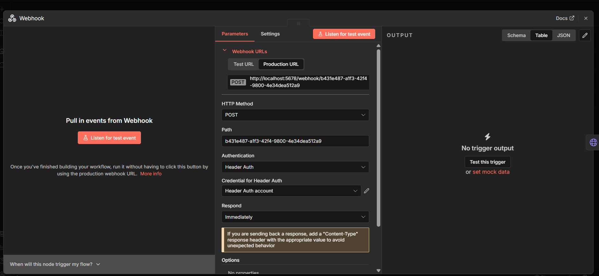
</p>

### Step 7 — Message Formatting Node (Edit Fields / Set)

Added an Edit Fields node after the HTTP Request node to assemble a single, human-readable `alert_message` string combining data from **two different upstream nodes** in the chain — the original Webhook payload (`rule.id`, `rule.description`, `srcip`) and the HTTP Request enrichment output (`country`, `city`, `isp`), using n8n's cross-node reference syntax `$('Webhook').item.json...` to reach back past the immediately-preceding node.

Fallback logic (`{{ $json.country || 'Unknown' }}`) was added so the message degrades gracefully to "Unknown"/"N/A" when enrichment data is unavailable (as with private/test IPs), rather than rendering broken template syntax or blank fields.

**Verified working** — full message correctly resolved with real enrichment data:

🚨 Wazuh Security Alert
Rule ID: 5710
Description: sshd brute force test
Source IP: 8.8.8.8
Location: United States, Ashburn
ISP: Google LLC
⚠️ Review and respond if necessary.


<p align="center">
  
</p>

### Step 8 — Discord Notification Node

Added a Discord node in **Webhook connection mode** (rather than Bot Token, which requires a full Discord Developer Portal application + bot invite flow — unnecessary complexity for this use case). Configured with `Operation: Send a Message`, message body bound to `{{ $json.alert_message }}` from the prior Edit Fields node.

**Verified working end-to-end** — a real message was posted to the `#wazuh-alert` Discord channel by "Wazuh SOAR Bot," rendering full Markdown formatting (bold field labels, emoji) correctly.

<p align="center">
  
</p>

**✅ Real-IP end-to-end proof** — fired purely at the Production URL, no editor interaction, real public-IP enrichment data landing correctly formatted in Discord:

<p align="center">
  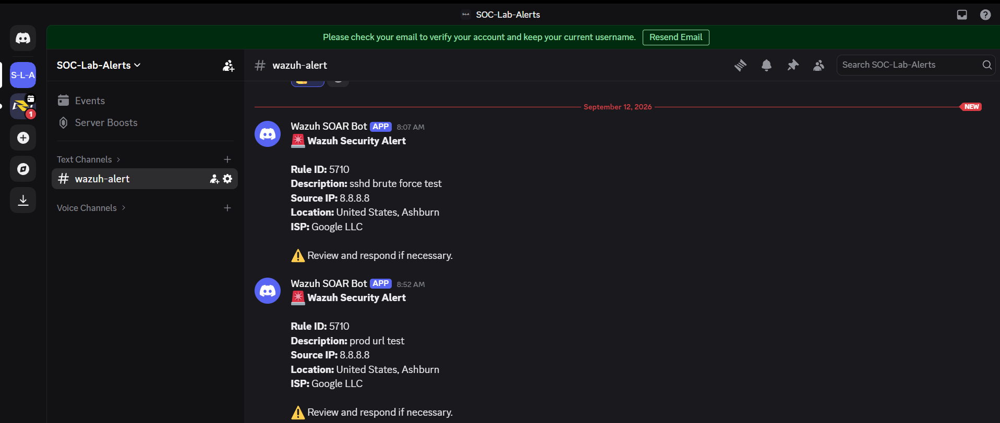
</p>

**Full 4-node pipeline confirmed green end-to-end** — every node (Webhook → HTTP Request → Edit Fields → Discord) executed successfully in a single run, each showing a green checkmark and correct item count flowing through the chain:

<p align="center">
  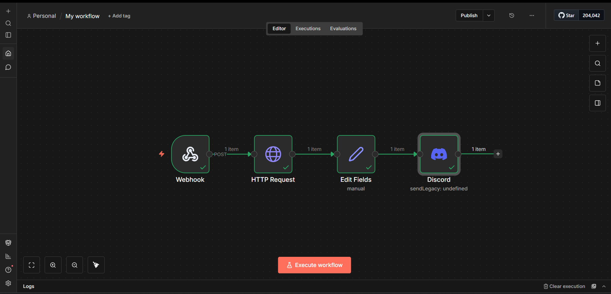
</p>

### Step 9 — Wazuh Active Response Integration (In Progress)

With the n8n pipeline fully validated as an always-on backend service, the remaining piece is making **Wazuh itself** call the Production URL automatically — no `curl` run by hand.

**9.1 — Custom Active Response script.** Wazuh's Active Response dispatches a JSON alert payload via stdin to a script placed in `/var/ossec/active-response/bin/` on the agent, matching the exact ownership/permission convention of the built-in `firewall-drop` script from Phase 2 (`root:wazuh`, mode `750`):

```bash
sudo chown root:wazuh /var/ossec/active-response/bin/n8n-notify-debug.sh
sudo chmod 750 /var/ossec/active-response/bin/n8n-notify-debug.sh
```

<p align="center">
  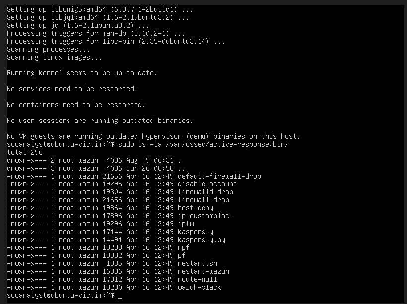
</p>

A **diagnostic version** of the script (`n8n-notify-debug.sh`) was written first, deliberately deferring the final `jq`-based JSON parsing logic until the real Wazuh stdin payload structure could be observed directly, rather than guessing field paths:

```bash
#!/bin/bash
echo "--- New trigger at $(date) ---" >> /tmp/wazuh-ar-debug.log
cat >> /tmp/wazuh-ar-debug.log
exit 0
```

Manually verified working before wiring into Wazuh at all:
```bash
echo '{"test":"manual invocation"}' | sudo /var/ossec/active-response/bin/n8n-notify-debug.sh
cat /tmp/wazuh-ar-debug.log
```

<p align="center">
  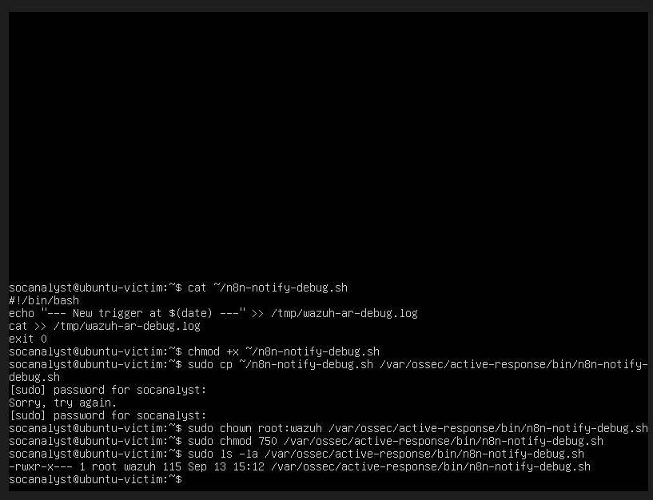
</p>

**9.2 — Wazuh-Manager configuration.** Following the exact pattern of Phase 2's `firewall-drop` binding (backed up first as `ossec.conf.bak-phase6`), a new `<command>` and `<active-response>` block pair was appended to the Manager's `ossec.conf`, bound to custom correlation rule `100010` (rather than the noisier raw rule `5710`) to keep the notification signal clean — one alert per confirmed brute-force pattern, not one per failed login attempt:

<p align="center">
  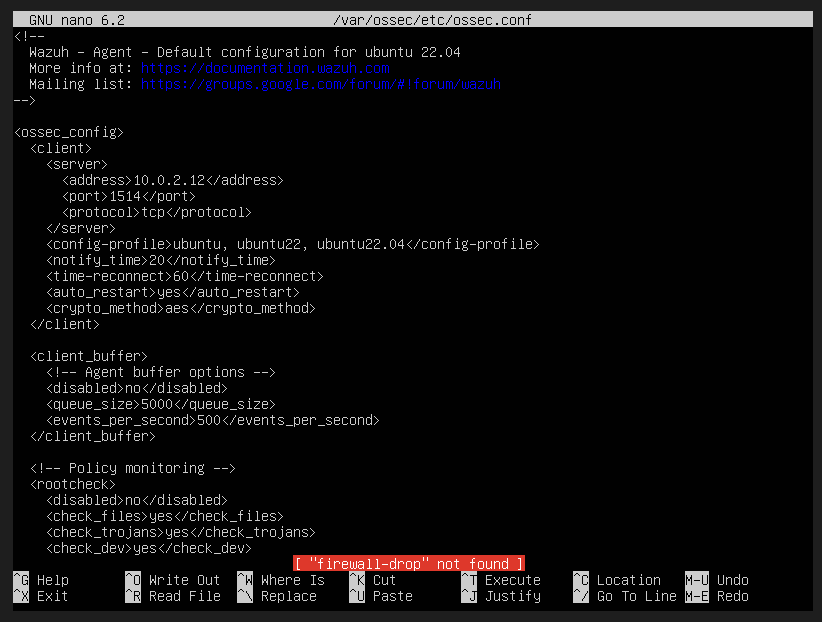
</p>

```xml
<command>
  <name>n8n-notify</name>
  <executable>n8n-notify-debug.sh</executable>
  <timeout_allowed>no</timeout_allowed>
</command>

<active-response>
  <disabled>no</disabled>
  <command>n8n-notify</command>
  <location>local</location>
  <rules_id>100010</rules_id>
</active-response>
```

Config validated clean (`wazuh-analysisd -t`, no errors) and the Manager restarted successfully with all modules up:

<p align="center">
  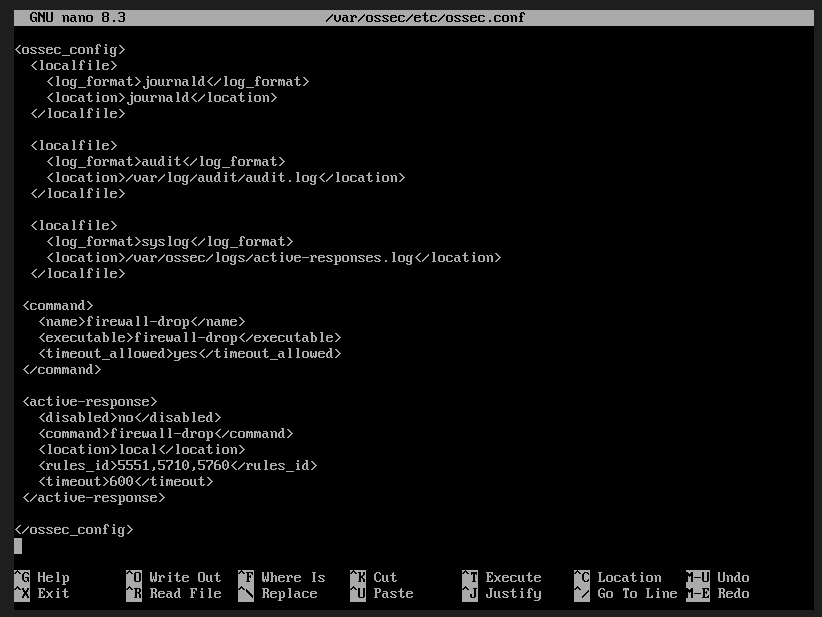
  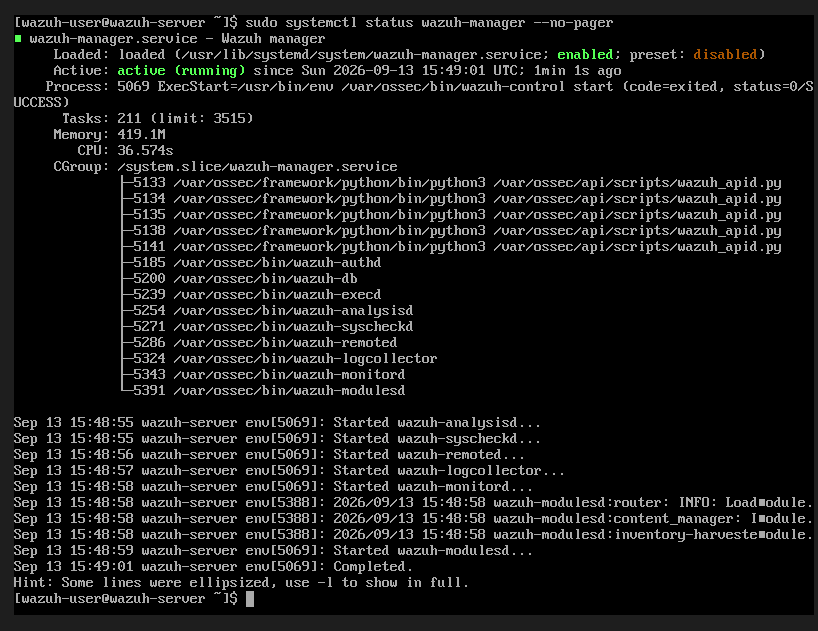
</p>

**9.3 — Live trigger test.** Rule `100010` (and its underlying `5710`) confirmed firing correctly via repeated SSH brute-force attempts:

<p align="center">
  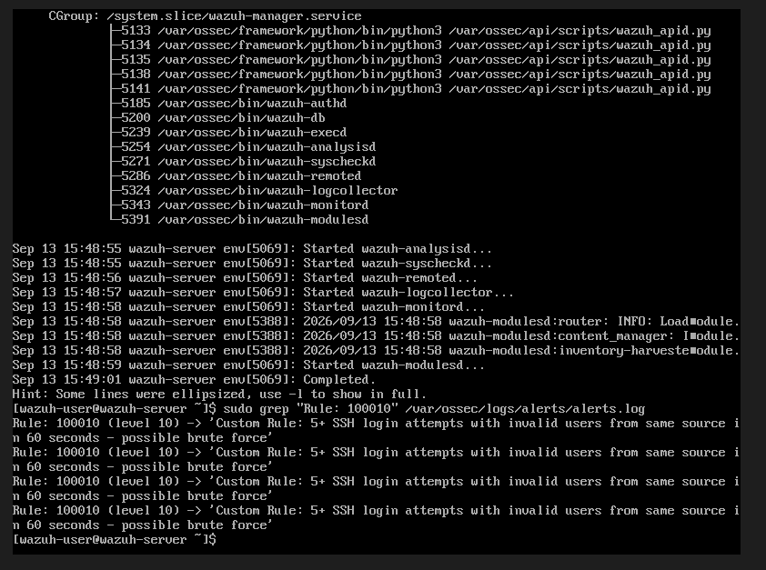
</p>

However — **the active-response dispatch itself never fired**, despite the rule correctly matching. `/tmp/wazuh-ar-debug.log` remained empty/nonexistent after multiple trigger attempts, and no execution trace appeared in either VM's `ossec.log`:

<p align="center">
  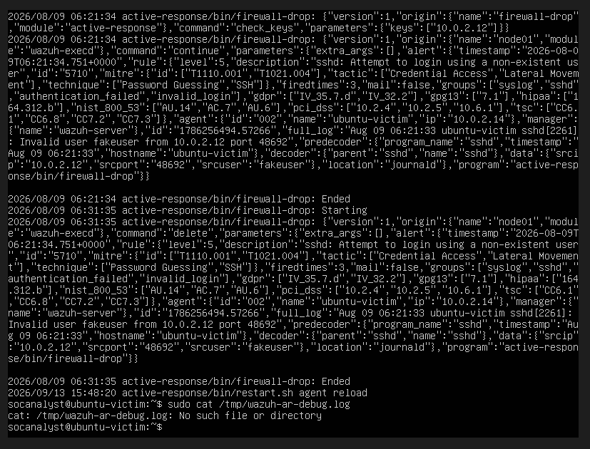
</p>

Full root-cause investigation and current status documented in Troubleshooting below — **this is the active blocker for Phase 6 completion.**

---

## 🔧 Build Log (continued)

### Step 9.4 — Wazuh-Manager Memory Pressure Resolved (swap + systemd timeout)

The Manager's `free -h` showing 253Mi available / zero swap (flagged in the original memory-pressure `<details>` block) was tracked down further and fully resolved, not just mitigated:

- Added 2GB of swap (`dd` + `mkswap` + `swapon`, persisted via `/etc/fstab`)
- Added a systemd drop-in override (`/etc/systemd/system/wazuh-manager.service.d/override.conf`, `TimeoutStartSec=300`) after discovering that `systemctl status wazuh-manager` was reporting `Active: failed (Result: timeout)` even though `wazuh-control status` showed every daemon genuinely running — systemd's default startup timeout was simply too short for a memory-constrained daemon burst, not a real crash.

<p align="center">
  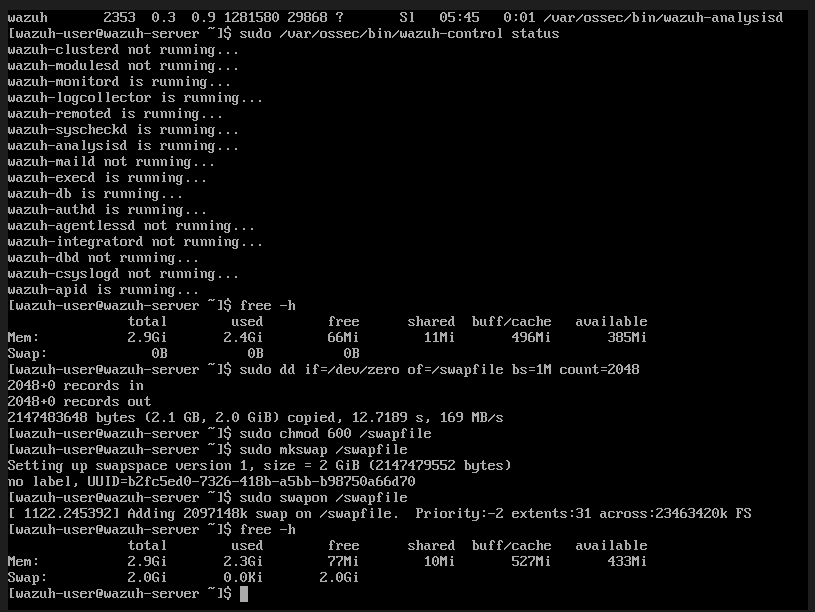
  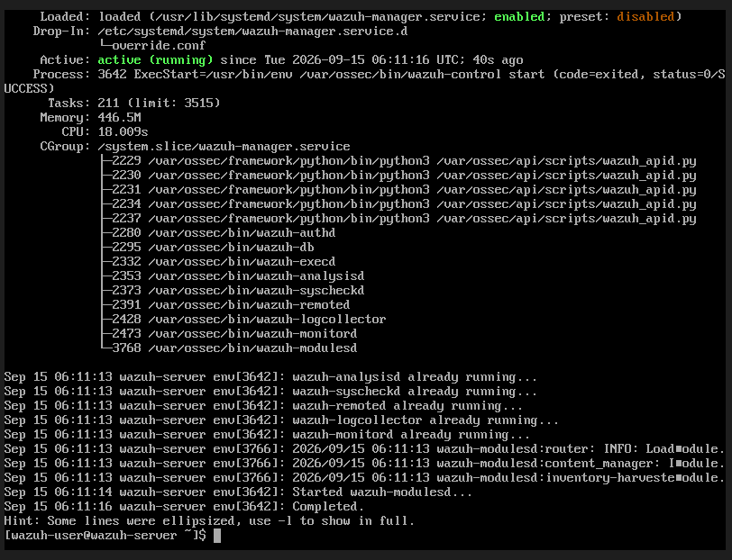
</p>

### Step 9.5 — Cross-Host Test Re-Run: Self-Lockout Root Cause Refined

With memory pressure resolved, the cross-host brute-force test was re-run. It still failed — but not for the whitelist reason originally suspected. Live-diagnosed by running `watch -n 1 'iptables -L INPUT -n --line-numbers'` on Ubuntu-Victim **during** the test (rather than checking after, which had previously missed the evidence since Active Response's default 600-second auto-unblock window had already expired by inspection time):

<p align="center">
  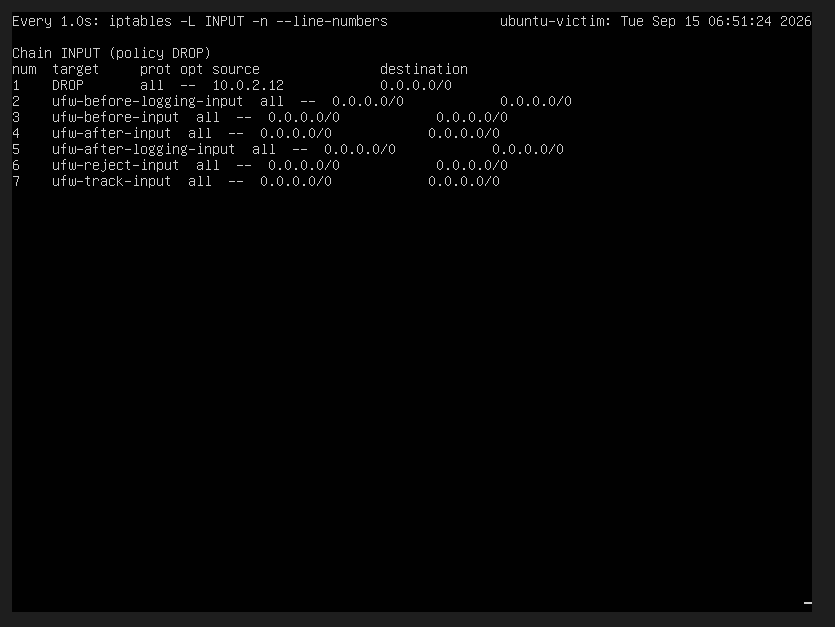
</p>

Root cause: the Manager's `<active-response>` block from Phase 2 is still wired to fire `firewall-drop` on rules `5551`, `5710`, **and** `5760` individually. The very first failed login matched `5710` on its own and instantly self-blocked the Manager — before rule `100010`'s 5-in-60s frequency window could even be evaluated. This is a *different* mechanism than the whitelist suppression documented earlier: that was about `127.0.0.1` being ignored outright; this is about a genuinely non-whitelisted source blocking itself via an unrelated rule binding.

**Fix:** temporarily added `10.0.2.12` (the Manager's own IP) to the global Active Response whitelist, specifically to suppress `firewall-drop` long enough to let rule `100010` actually fire — an intentional, reversible, documented suppression for isolating one variable, not a permanent change.

<p align="center">
  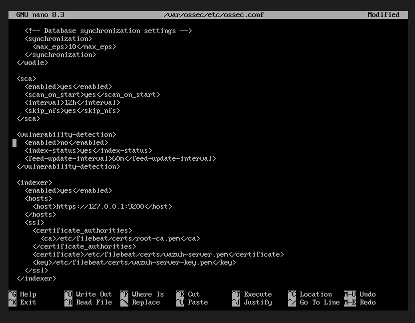
  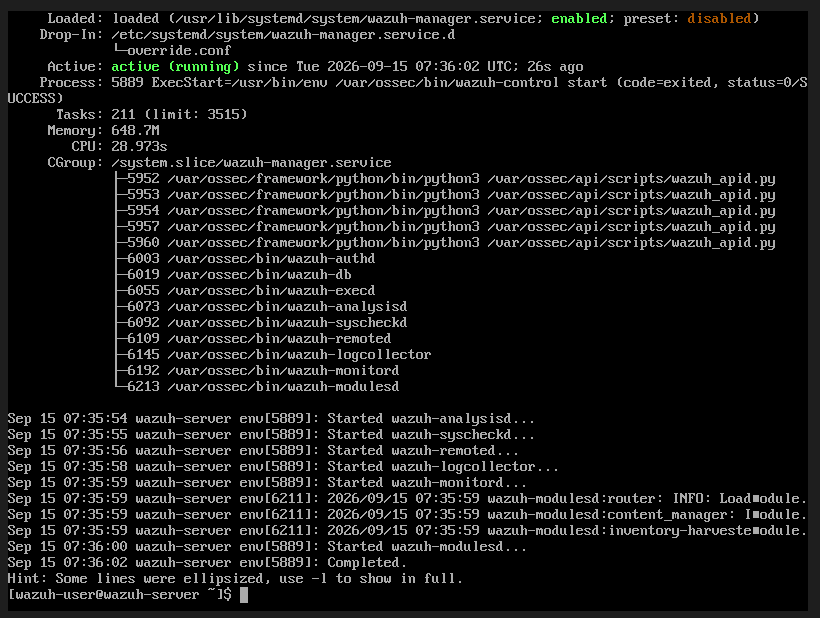
</p>

### Step 9.6 — Rule 100010 Confirmed Firing Cleanly (blocker isolated further)

With both issues fixed, the full 6-iteration test finally ran uninterrupted. Rule `100010` fired **multiple times**, each with a complete, well-formed alert body including a correct `Src IP` field:

<p align="center">
  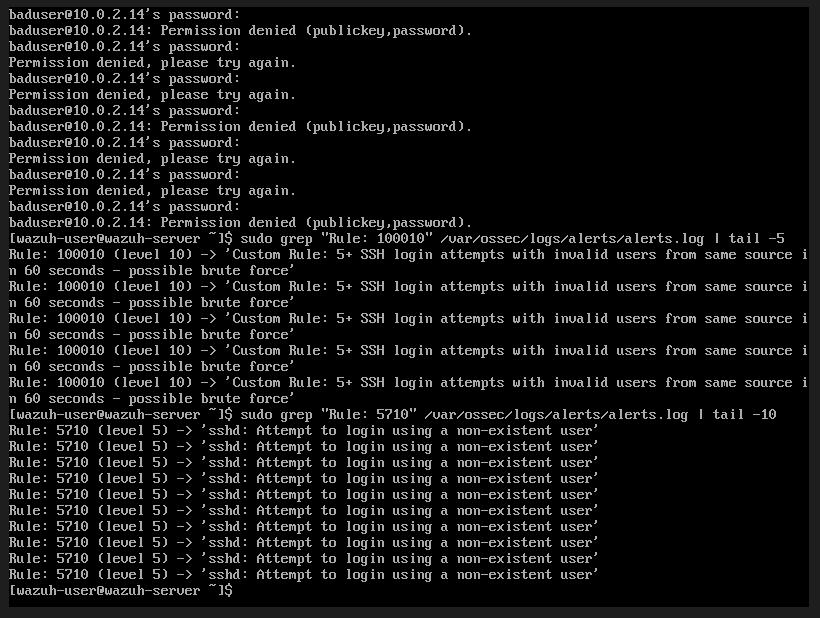
  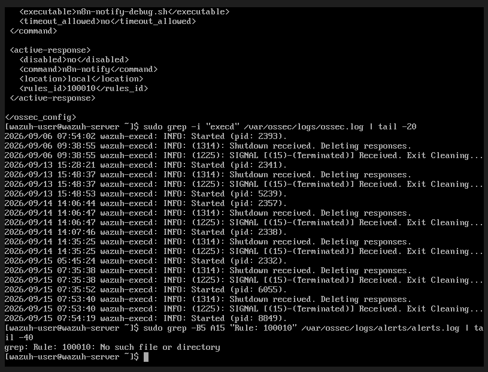
</p>

### Step 9.7 — Active Response Still Does Not Dispatch (open issue)

Despite every identified prerequisite now confirmed healthy, `/tmp/wazuh-ar-debug.log` was **still never created**:

<p align="center">
  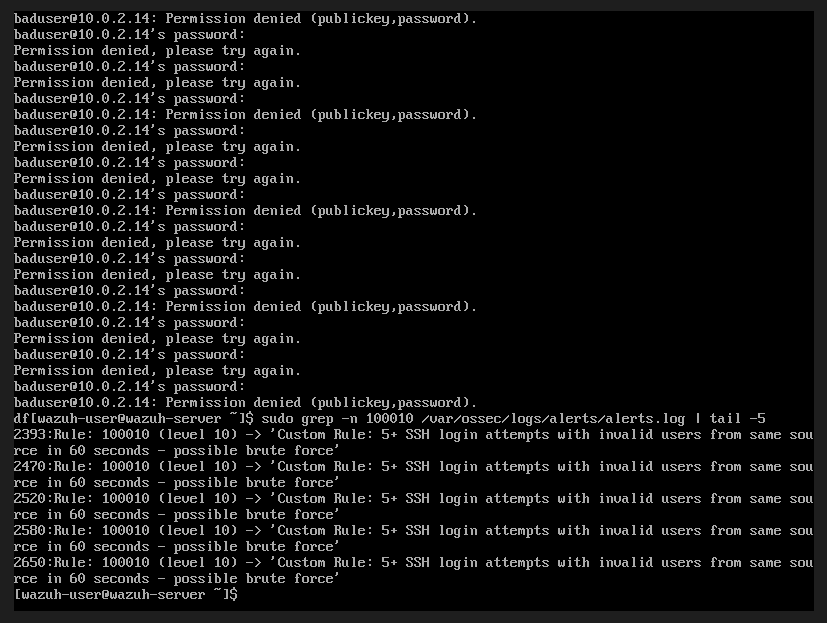
</p>

Systematically ruled out, in order:
- **Whitelist suppression for this test** — `grep -i whitelist ossec.log` showed no matching entry for this test window
- **Agent registration** — confirmed `ID: 002, Name: ubuntu-victim, IP: any, Active`
- **Script permissions** — `n8n-notify-debug.sh` confirmed `root:wazuh`, mode `750`, identical to the working `firewall-drop` script
- **Command/rule binding syntax** — `ossec.conf` block reviewed line-by-line, structurally correct
- **Control comparison** — `firewall-drop` (bound to `5710`, previously proven working in Phase 2) **also** failed to dispatch during this same test window, ruling out anything specific to the new custom command and pointing instead to something systemic in the current dispatch pipeline

<p align="center">
  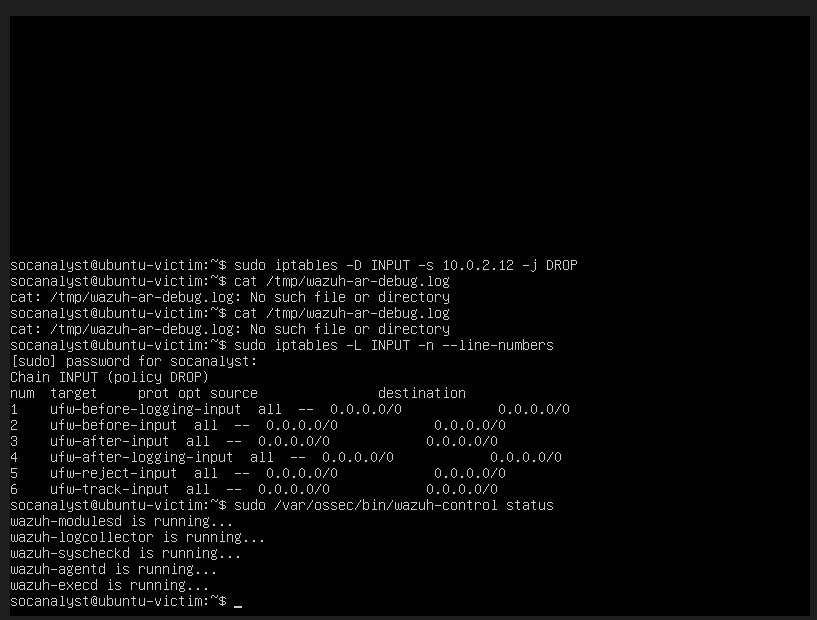
  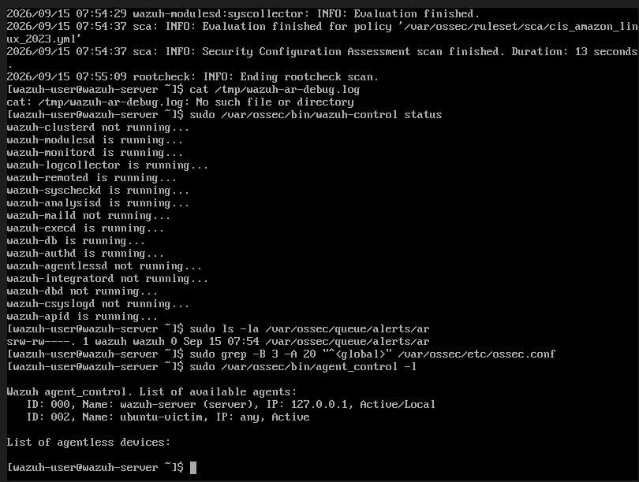
</p>

`analysisd.debug=2` and `execd.debug=2` were enabled via `local_internal_options.conf` and the Manager restarted cleanly with debug logging confirmed active, ready to capture the daemons' actual internal dispatch decision on the next test run:

<p align="center">
  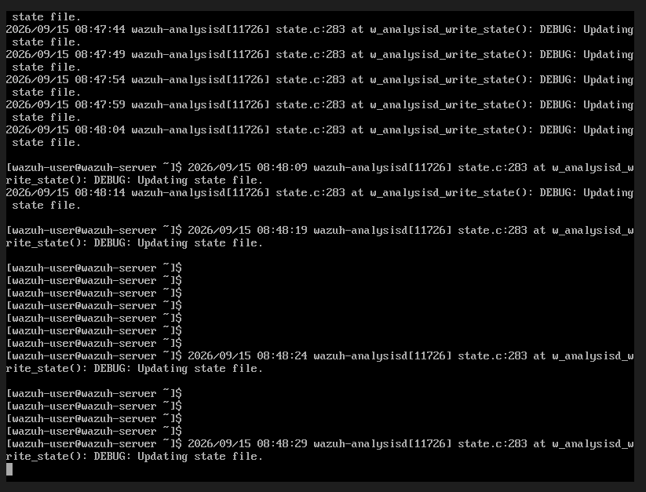
</p>

**This is the confirmed, isolated, current blocker for Phase 6 completion — the live debug-logged test run itself has not yet been executed/analyzed.**

---

## 🧰 Additional Troubleshooting

<details>
<summary><b>💥 Disk exhaustion (100% full) discovered mid-troubleshooting, traced to 17GB of stale Vulnerability Detector cache</b></summary>
<br>

> While backing up `ossec.conf` before the whitelist edit, `sudo cp` failed outright: `cp: cannot create regular file ... No space left on device`.

<p align="center">
  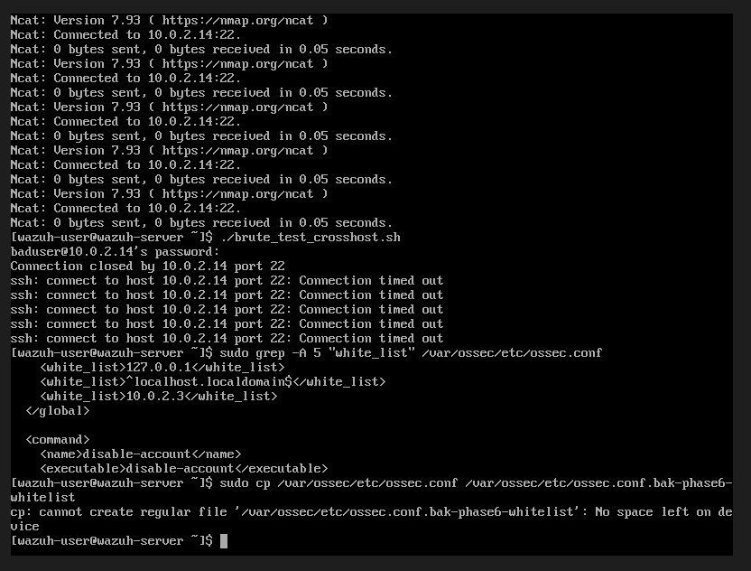
  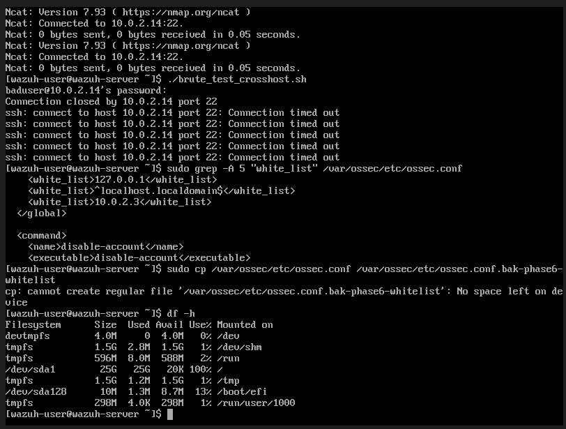
</p>

> Traced top-down: `/var` (19G) → `/var/ossec` (18G) → `/var/ossec/queue` (18G) → `/var/ossec/queue/vd` (12G, the Vulnerability Detector's raw CVE feed data) and `/var/ossec/queue/vd_updater` (5.1G, almost entirely a stale `tmp/` subdirectory left behind by interrupted hourly feed-update cycles running unattended since April, given the module's default `<feed-update-interval>60m</feed-update-interval>`).

<p align="center">
  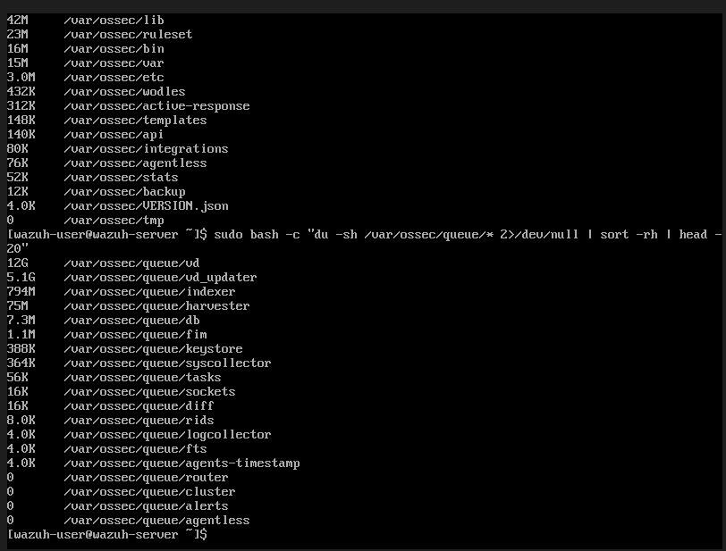
  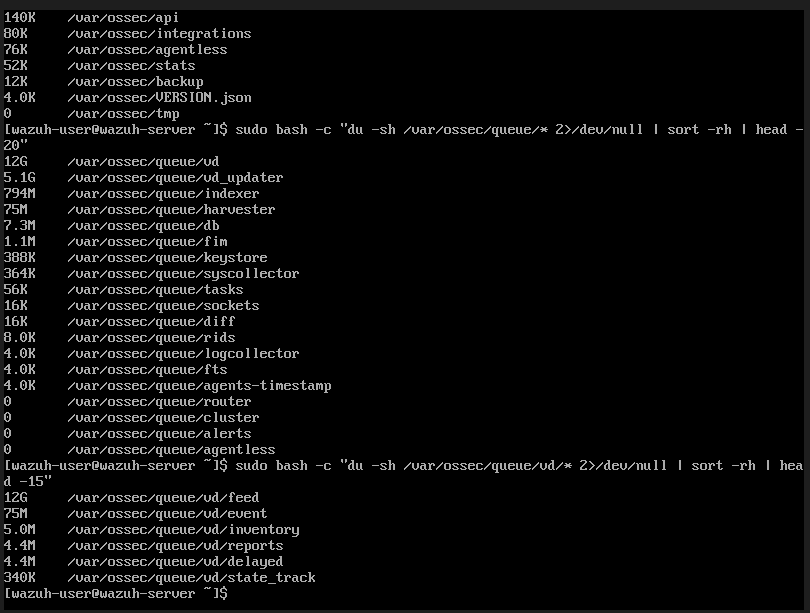
</p>

> Given ~2,549+ of the Phase 5 baseline's ~9,900 alerts were already attributed to this same module (rules `23504`/`23505`/`23508`, classified "Benign-but-Alerting"), this tracks as a natural consequence of a long-running, unmaintained lab rather than a misconfiguration. **Fix:** disabled `<vulnerability-detection><enabled>` (not required for Phase 6 testing), confirmed via `lsof` that no process held the stale files open, then cleared `vd_updater/tmp/contents` and `vd_updater/tmp/downloads` directly — 5.1G reclaimed, disk usage dropped from **100% → 78%**.

<p align="center">
  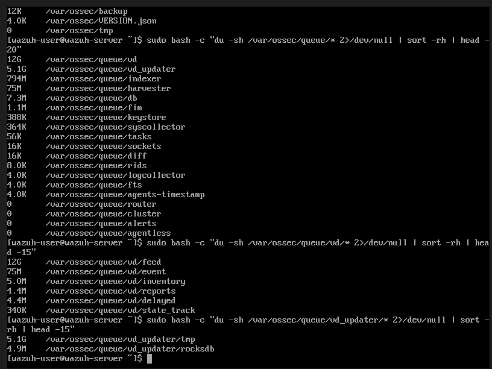
</p>

> A transient `wazuh-modulesd` segfault (`in libvulnerability_scanner.so`) occurred on the first restart immediately after this cleanup — likely the module's on-disk feed state being read mid-inconsistency from the abrupt space exhaustion. A second clean restart resolved it without further intervention. **Lesson:** disk exhaustion on a long-running SOC lab can produce a wide, confusing spread of secondary symptoms that look unrelated to storage at first glance (failed backups, `nano` refusing to save, inconsistent test behavior) — `df -h` should be an early diagnostic step whenever multiple unrelated-seeming failures appear in the same session, not a last resort.

</details>

---

## 📌 Status Summary (supersedes the "Active blocker" section above)

**Newly resolved this session:**
- ✅ Wazuh-Manager memory pressure — genuinely fixed (2GB swap + systemd `TimeoutStartSec` override), not just worked around
- ✅ Cross-host self-lockout — root-caused precisely to rule `5710`'s existing `firewall-drop` binding, not the whitelist itself
- ✅ Rule `100010` confirmed firing correctly and repeatedly under clean, uninterrupted test conditions, with a well-formed alert body
- ✅ Disk exhaustion (100% full, 17G of stale Vulnerability Detector cache) diagnosed and partially reclaimed (5G freed, module disabled)

**Still open — this is now the sole remaining blocker:**
- 🔴 Active Response dispatch for rule `100010` (and, as a control comparison, even the previously-working `5710`/`firewall-drop`) does not fire, despite every identified prerequisite — whitelist, agent registration, script permissions, config syntax, queue socket health — confirmed correct. `analysisd`/`execd` debug logging (level 2) is enabled and ready; the concrete next step is re-running the test with debug logging live and searching the output for `ar_`/dispatch-decision log lines to see analysisd's actual internal reasoning.

**Unchanged from before:**
- ⏳ Once dispatch is confirmed working, replace `n8n-notify-debug.sh` with the production version using the captured payload structure
- ⏳ Full live end-to-end test with zero manual triggering anywhere in the chain
- ⏳ Persistent Cloudflare Named Tunnel migration (deferred, non-blocking)
- ⏳ Re-enable `vulnerability-detection` and address the remaining 12G `vd/feed` directory once Phase 6's core automation is confirmed working

---

<div align="center">

*Built with 🔐 for learning — Phase 6 in progress. Documented honestly, including what isn't solved yet.*

</div>
