<div align="center">

# Phase 6 - n8n SOAR Orchestration Layer
### Workflow Automation for Wazuh Alert Enrichment & Notification

*A step-by-step, in-progress record of standing up a self-hosted n8n automation layer on top of the existing Wazuh-Snort pipeline, exposing it securely to the internet without a VPS or open inbound ports, and building an authenticated webhook-driven SOAR workflow.*

---


</div>

---

## 🎯 Objective

Phases 0–5 built a complete detection, response, and tuning pipeline entirely within Wazuh + Snort. Phase 6 adds a genuine **SOAR orchestration layer** on top: when a high-severity Wazuh alert fires (e.g., rule `5710`/`100010`, SSH brute-force), an outbound webhook triggers an [n8n](https://n8n.io) workflow that will:

1. Receive and authenticate the alert payload
2. Enrich the source IP (geolocation via `ip-api.com`)
3. Format a readable, analyst-friendly summary
4. Push a real-time notification to Discord

This closes the loop from *detection* → *automated triage support* → *human notification*, the core concept behind SOAR (Security Orchestration, Automation, and Response), while staying honest about the difference between this single-tool automation and a full cross-tool SOAR platform (see README's note on scope).

---

## 🖥️ Infrastructure Decision: Why No Third VM / No Cloud VPS

**Constraint:** 8GB RAM host, 2 existing VMs (Wazuh Manager, Ubuntu Victim) already running Snort + Wazuh Agent. A prior Wazuh Indexer OOM-kill incident (documented in Phase 0/1) made the team deliberately cautious about adding load.

**Options evaluated:**

| Option | Verdict |
|---|---|
| Docker Desktop / third local VM | ❌ Ruled out — insufficient host RAM headroom |
| Oracle Cloud Always Free (Ampere A1) | ❌ Ruled out — requires a credit card for identity verification, even though never billed; not available without one |
| n8n Cloud SaaS | ❌ Trial-only, not viable long-term for a portfolio project |
| Render / Railway free tier | ⚠️ Workable but cold-start delays undermine real-time alerting |
| **n8n self-hosted on existing Ubuntu Victim VM + Cloudflare Tunnel** | ✅ **Selected** |

**Rationale:** n8n installed via `npm` (not Docker) has a small footprint (~200Mi resident RAM measured in practice — see Memory Impact table below). Combined with Cloudflare Tunnel's **fully outbound-initiated** connection model, this avoids opening any inbound port on the lab network entirely — a stronger security posture than a traditional VPS + open firewall port, and a genuine architectural decision worth defending in review: *no listening port exists for an attacker to discover or scan*.

---

## 📊 Memory Impact — Empirically Validated

Given the prior OOM-kill history, every install step was memory-checked before and after.

<div align="center">

| Stage | Available RAM (`free -h`) |
|:---|:---:|
| Baseline (Snort + Wazuh Agent only, post security patch + reboot) | 967Mi |
| After Node.js 20.x install | 985Mi |
| After n8n install (idle, not running) | 1.0Gi |
| **With n8n actively running** | **767Mi** |
| Swap usage under load | 87Mi (of 2.1Gi — untouched majority) |

</div>

**n8n's real-world memory cost: ~200Mi.** Comfortably within budget, with ~750Mi headroom remaining and a full swap safety margin unused. n8n 2.x's process model was also observed and documented: it splits into a main process plus an isolated **task-runner subprocess** for workflow execution sandboxing — a defense-in-depth detail worth noting.

<p align="center">
  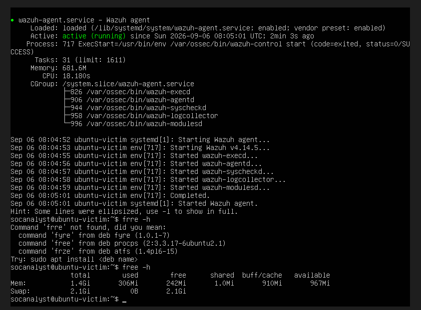
</p>

---

## 🔧 Build Log

### Step 1 — Security Patching (pre-work)

Before exposing any new service to the internet, the Ubuntu Victim VM's pending security updates were applied via a **dry-run-then-apply** process (`apt-get -s dist-upgrade` reviewed before real execution), specifically checking that no patch touched `snort` or `wazuh-agent` package versions. A kernel update was included (`5.15.0-185` → `5.15.0-191`), requiring a reboot; Snort and Wazuh Agent service health was verified both immediately pre-reboot and post-reboot to confirm no regression from the kernel bump.

### Step 2 — Node.js 20.x LTS Installation

Installed via the NodeSource repository (required — Ubuntu 22.04's default `apt` repo only carries Node 12.x, which is EOL and incompatible with n8n).

<p align="center">
  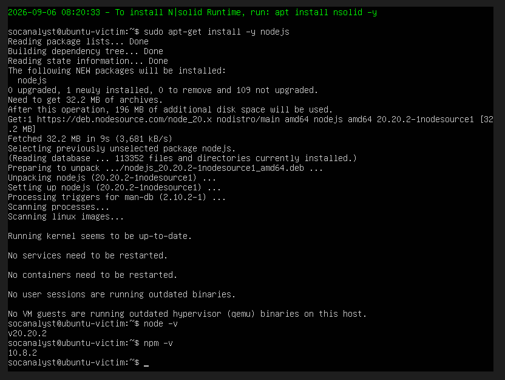
</p>

### Step 3 — n8n Installation

```bash
sudo npm install -g n8n
```

Version installed: **2.8.4**. Install took ~17 minutes on this VM's constrained CPU allocation (1917 packages), a useful data point for planning future installs on similarly constrained hardware.

<p align="center">
  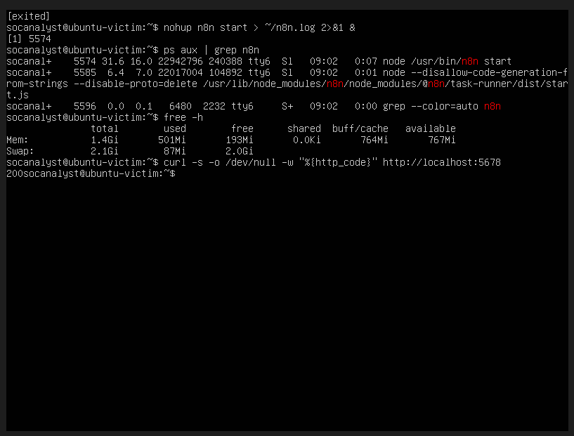
</p>

### Step 4 — Cloudflare Tunnel Installation & Configuration

Installed via Cloudflare's official apt repository (`pkg.cloudflare.com`), version **2026.8.3**. Runs in **Quick Tunnel** mode currently (`cloudflared tunnel --url http://localhost:5678 --protocol http2`) — no Cloudflare account required, generates a random public `*.trycloudflare.com` HTTPS URL with a fully outbound connection to Cloudflare's edge.

**Known limitation (tracked, not yet resolved):** Quick Tunnel URLs are ephemeral — a new random URL is issued every time the `cloudflared` process restarts. A **Named Tunnel** (requires free Cloudflare account + a domain) is the planned upgrade path for a persistent, production-style URL. Deferred as a later task since it doesn't block current build/test work.

<p align="center">
  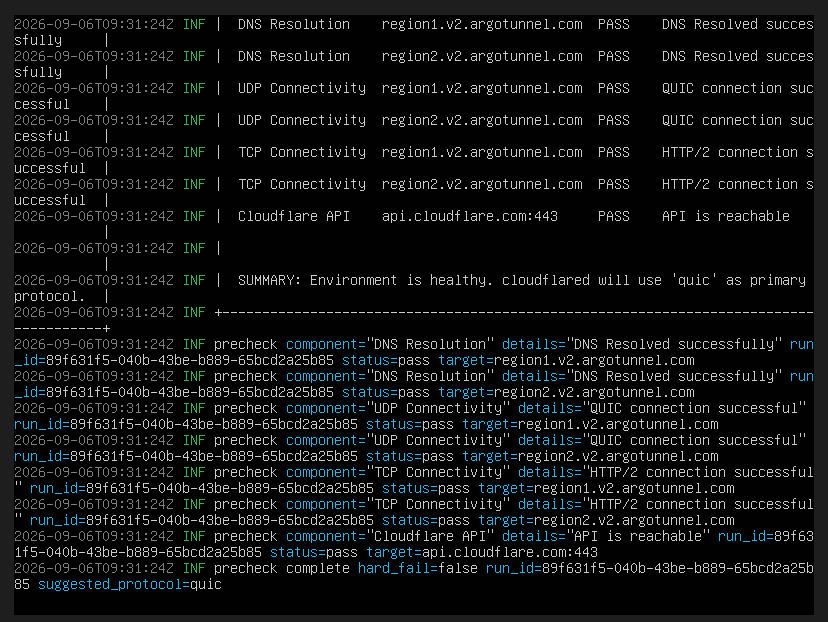
</p>

A significant mid-build obstacle was a broken DHCP-assigned DNS server preventing tunnel registration entirely (full root-cause narrative in Troubleshooting below); the permanent fix via a custom netplan override is confirmed working here:

<p align="center">
  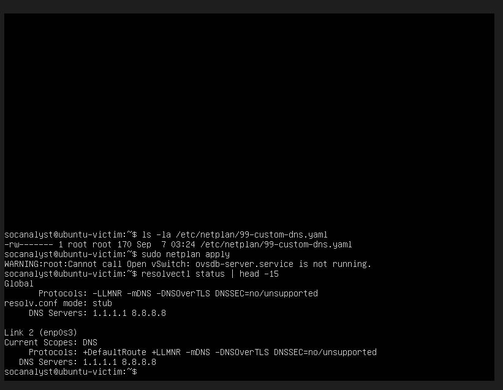
</p>

### Step 5 — n8n Webhook Node (Trigger)

End-to-end reachability was confirmed first by loading the n8n editor itself through the public tunnel URL from an external browser (i.e., genuinely over the internet, not just `localhost`):

<p align="center">
  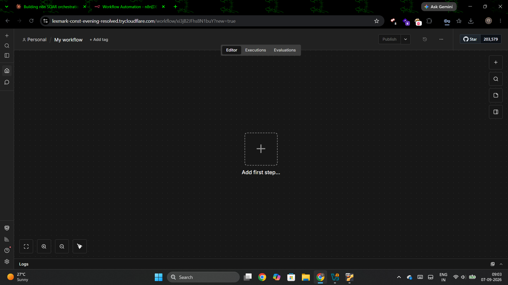
</p>

Configured as the workflow's entry point:

| Setting | Value | Rationale |
|---|---|---|
| HTTP Method | `POST` | Matches how Wazuh's Active Response script will deliver alert JSON |
| Path | Random UUID (n8n auto-generated, kept as-is) | Acts as a lightweight secret in the URL — reduces discoverability |
| Authentication | Header Auth (`X-Wazuh-Secret` + 64-char random hex secret via `openssl rand -hex 32`) | Real access control — requests without the correct header/value are rejected |
| Respond | Immediately | Keeps the caller (Wazuh) non-blocked while downstream enrichment/notification runs |

**Verified working** via a manual `curl` test simulating a Wazuh rule `5710` alert payload — the webhook correctly received and authenticated the request, capturing `rule.id`, `rule.description`, and `srcip` in the payload body.

<p align="center">
  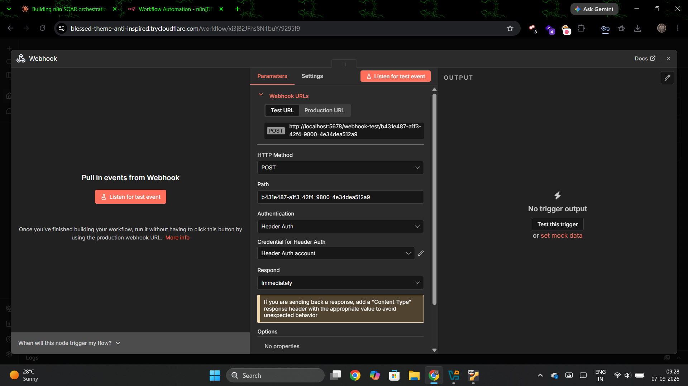
  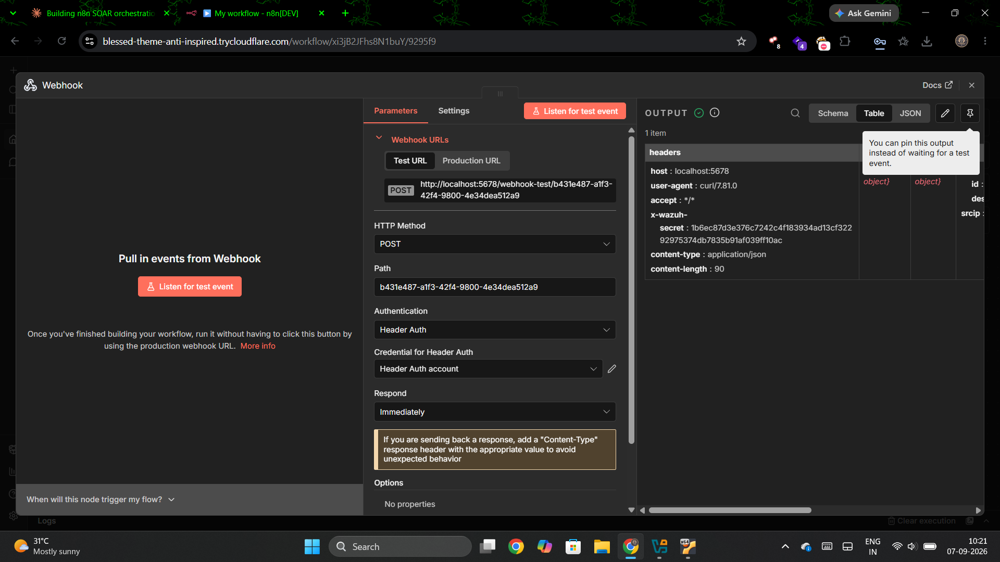
</p>

### Step 6 — IP Enrichment Node (HTTP Request)

Added an HTTP Request node calling `ip-api.com` (free tier, no API key required) with the source IP dynamically extracted from the incoming webhook payload via the n8n expression `{{ $json.body.srcip }}`.

**Verified working** — test executed against the placeholder test IP `192.168.1.100`, correctly returning `status: fail, message: private range` from ip-api.com. This is the *correct* expected result for a private/RFC 1918 test address, confirming the request mechanism itself (URL construction, expression resolution, live HTTP call) functions correctly. Full validation against a real public attacker IP is planned for the live end-to-end test phase.

<p align="center">
  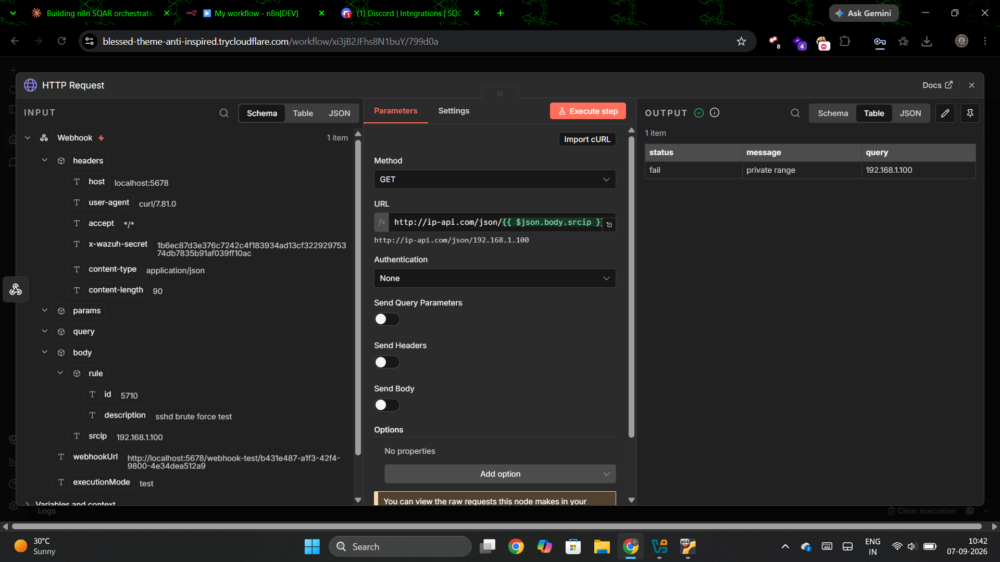
</p>

### Step 7 — Message Formatting Node (Edit Fields / Set)

Added an Edit Fields node after the HTTP Request node to assemble a single, human-readable `alert_message` string combining data from **two different upstream nodes** in the chain — the original Webhook payload (`rule.id`, `rule.description`, `srcip`) and the HTTP Request enrichment output (`country`, `city`, `isp`), using n8n's cross-node reference syntax `$('Webhook').item.json...` to reach back past the immediately-preceding node.

Fallback logic (`{{ $json.country || 'Unknown' }}`) was added so the message degrades gracefully to "Unknown"/"N/A" when enrichment data is unavailable (as with private/test IPs), rather than rendering broken template syntax or blank fields.

**Verified working** — full message correctly resolved with live test data:
```
🚨 Wazuh Security Alert
Rule ID: 5710
Description: sshd brute force test
Source IP: 192.168.1.100
Location: Unknown, Unknown
ISP: N/A
⚠️ Review and respond if necessary.
```

<p align="center">
  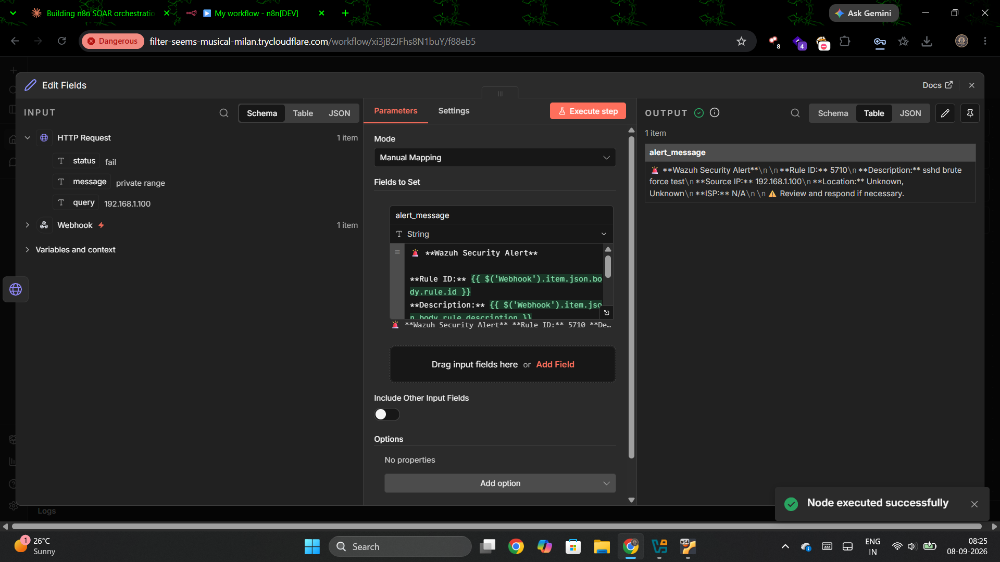
</p>

### Step 8 — Discord Notification Node

Added a Discord node in **Webhook connection mode** (rather than Bot Token, which requires a full Discord Developer Portal application + bot invite flow — unnecessary complexity for this use case). Configured with `Operation: Send a Message`, message body bound to `{{ $json.alert_message }}` from the prior Edit Fields node.

**Verified working end-to-end** — a real message was posted to the `#wazuh-alert` Discord channel by "Wazuh SOAR Bot," rendering full Markdown formatting (bold field labels, emoji) correctly.

<p align="center">
  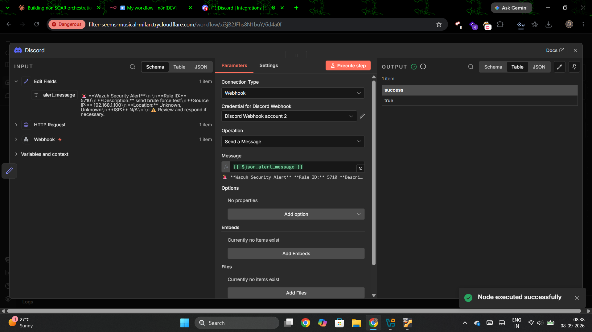
</p>

**Final proof of the complete pipeline** — the actual message as it landed in Discord:

<p align="center">
  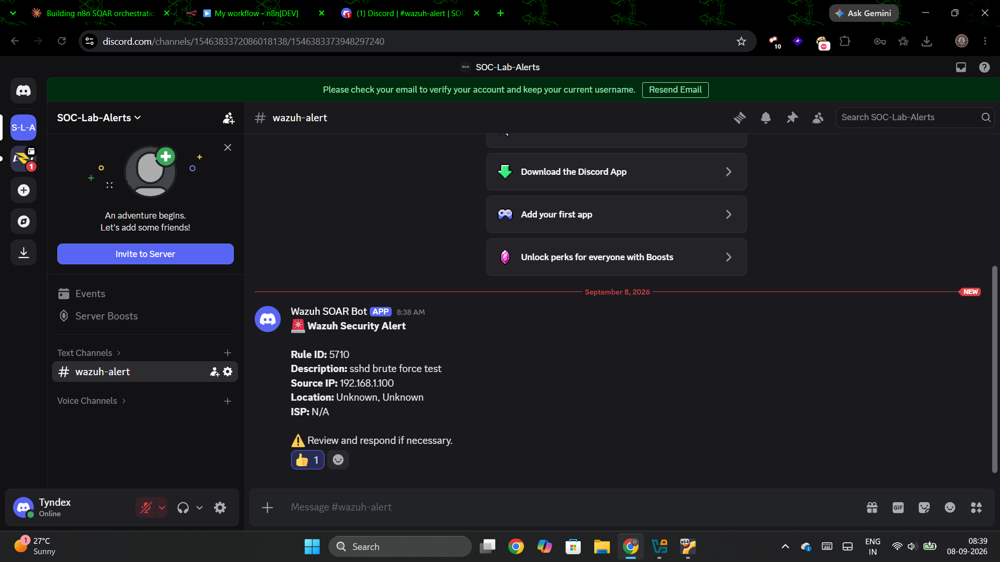
</p>

---

## 🧰 Notable Troubleshooting (real incidents, documented in full)

<details>
<summary><b>⌨️ Repeated DNS typo (deb.nodesource.com → ded.nodesource.com)</b></summary>
<br>

> The NodeSource install script failed silently due to a one-character DNS typo, causing `apt-get install nodejs` to fall back to Ubuntu's stale default repo (Node 12.x) without any obvious error at the install step itself. Caught only by explicitly checking `node -v` after install rather than assuming success. Root-caused, corrected, and re-verified across two full retry cycles before the correct NodeSource repo was properly registered.

</details>

<details>
<summary><b>🌐 Cloudflare Tunnel registration hanging indefinitely (root cause: broken DHCP-assigned DNS)</b></summary>
<br>

> `cloudflared tunnel` would pass all environment preflight checks (DNS resolution, TCP/UDP connectivity, Cloudflare API reachability) but then hang indefinitely at tunnel registration, even after forcing HTTP2 over QUIC. Initially suspected to be mobile-carrier deep packet inspection (a genuine and common issue on Indian mobile networks) after switching hotspots produced a *different*, more specific error: `dial tcp: lookup api.trycloudflare.com on 127.0.0.1:53: i/o timeout`.
>
> Root-caused to the VM's DHCP-assigned DNS server (`192.168.103.185`) being unreachable through VirtualBox's NAT layer, despite general internet connectivity (`ping 1.1.1.1`) working fine. Runtime fixes via `resolvectl dns` were repeatedly and silently overridden by DHCP re-injection. Permanently resolved by identifying that `/etc/netplan/50-cloud-init.yaml` is cloud-init-managed (edits don't persist across reboot) and instead creating a separate override file `/etc/netplan/99-custom-dns.yaml` with explicit `dhcp4-overrides: use-dns: false` to fully suppress DHCP-supplied DNS in favor of `1.1.1.1`/`8.8.8.8`. A secondary file-permission issue (`600` required, initially `644`) was also caught and corrected along the way.
>
> **Lesson:** a hung network handshake can have a root cause several layers removed from the failing tool itself — proper diagnosis required peeling back from application-layer symptom (tunnel timeout) → protocol test (QUIC vs HTTP2) → raw connectivity test → DNS-specific test → persistent-vs-runtime config distinction, rather than accepting the first plausible explanation (carrier DPI).

</details>

<details>
<summary><b>🖥️ VirtualBox console keyboard-shortcut interception blocking tmux</b></summary>
<br>

> Attempted to use `tmux` to split a single terminal into two panes (to monitor `free -h` while `n8n start` ran in the foreground) for lack of a working second SSH path from the Windows host (no port-forward configured for SSH, unlike the Wazuh Dashboard's existing port-forward). `Ctrl+B` prefix commands were silently swallowed by the VirtualBox console window rather than reaching tmux, evidenced by the literal characters appearing typed at the shell prompt instead of triggering a pane split. Resolved by abandoning tmux for this use case and instead backgrounding long-running processes properly (`Ctrl+Z` → `bg` → `disown -h`) combined with `nohup ... &` for services that need to persist independent of any single terminal session.

</details>

<details>
<summary><b>📋 Multi-line curl commands corrupted by VM console paste handling</b></summary>
<br>

> Multiple attempts to paste a multi-line `curl` command (using `\` line continuations) directly into the VirtualBox console terminal resulted in corrupted commands — dropped characters (notably the `5678` port number and `/` path separator vanished from pasted URLs on two separate occasions), producing confusing "bad/illegal URL format" and "nested brace" errors that did not reflect any actual mistake in the command as written. Resolved by writing the command into a file via `nano` (which handled the same paste content correctly) and executing it as a script (`bash test_webhook.sh`) rather than pasting directly at the shell prompt. **Lesson:** when a command that looks syntactically correct produces bizarre parser errors, verify the *actual* received input (`cat` the file) before assuming a logic error — the terminal's paste path itself was the fault, not the command.

</details>

<details>
<summary><b>🔗 n8n test-node execution requires re-priming the full upstream chain after a session gap</b></summary>
<br>

> Returning to the workflow in a new session, the Edit Fields node's "Execute step" initially failed silently ("No output data") because n8n's per-node test cache does not automatically persist/propagate across nodes when reopening a workflow — each node in the chain (Webhook → HTTP Request → Edit Fields) needed to be re-triggered in order (re-listen + re-send test webhook, then re-execute HTTP Request, then re-execute Edit Fields) before the final node had valid upstream data to resolve its cross-node expressions against. n8n's own in-editor hint (`Tip: Execute previous nodes to use input data`) pointed directly at the fix once noticed.

</details>

<details>
<summary><b>🌐 Discord webhook returning HTTP 301 on first credential attempt</b></summary>
<br>

> The first Discord Webhook credential produced `301 - ""` on execution — an unexpected redirect response where Discord's webhook API normally returns 200/204 on success. Root cause not conclusively isolated (candidates: a stray character/whitespace introduced during copy-paste from Discord's webhook URL, or a request to the legacy `discordapp.com` domain rather than the current `discord.com`), but resolved cleanly by deleting and re-creating the credential with a freshly re-copied URL, which then tested and executed successfully (`success: true`, message confirmed delivered to Discord). **Lesson:** for opaque low-level HTTP errors on a third-party webhook, re-issuing the credential from a clean copy is often faster than exhaustively diagnosing the exact byte-level cause.

</details>

---

## 📌 Current Status Summary

**Completed and verified — full workflow pipeline operational end-to-end:**
- ✅ Infrastructure decision made and documented (self-hosted + Cloudflare Tunnel vs. cloud VPS)
- ✅ Security patching applied to host VM with Snort/Wazuh Agent regression-checked pre/post
- ✅ Node.js 20.x LTS + n8n 2.8.4 installed, memory footprint empirically validated (~200Mi)
- ✅ Cloudflare Tunnel (Quick Tunnel mode) installed and validated end-to-end (public URL → n8n editor load confirmed from external browser)
- ✅ Webhook trigger node built: POST, random path, Header Auth secret — tested with simulated Wazuh alert payload
- ✅ IP enrichment node built: `ip-api.com` HTTP Request with dynamic `srcip` expression — tested against placeholder IP
- ✅ Message-formatting node (Edit Fields) — combines data across multiple upstream nodes with graceful fallback handling, verified fully resolved
- ✅ Discord notification node — webhook-mode connection, **live test message successfully delivered** to a real Discord channel

**Full pipeline confirmed working, end to end, with simulated alert data:**
```
curl (simulating Wazuh) → Cloudflare Tunnel → n8n Webhook (authenticated)
  → IP enrichment (ip-api.com) → message formatting → Discord notification
```

**Remaining work (not yet started):**
- ⏳ Full end-to-end test with a real public source IP (to validate ip-api.com enrichment against a genuine geolocation/ISP result, not just the "private range" test case — current test data uses `192.168.1.100`, a non-routable placeholder)
- ⏳ Wazuh Active Response script configuration — the piece that will make Wazuh actually call this n8n webhook automatically on rule `5710`/`100010` firing, replacing the manual `curl` test script used throughout this build phase
- ⏳ Decision + migration to a persistent Cloudflare **Named Tunnel** (stable URL, survives restarts) — deferred, Quick Tunnel sufficient for current build/test phase; current limitation is that every `cloudflared` restart issues a new random URL requiring manual reconfiguration downstream
- ⏳ Final SOC-style alert reference table and before/after evidence, to be completed once the live end-to-end test (real Kali-generated attack → real Wazuh alert → automatic Discord notification) is run

---

<div align="center">

*Built with 🔐 for learning — Phase 6 in progress.*

</div>
